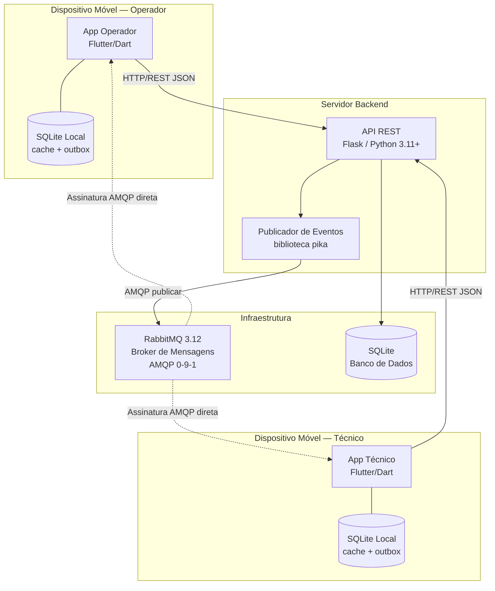
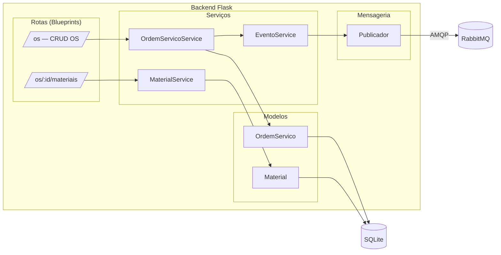
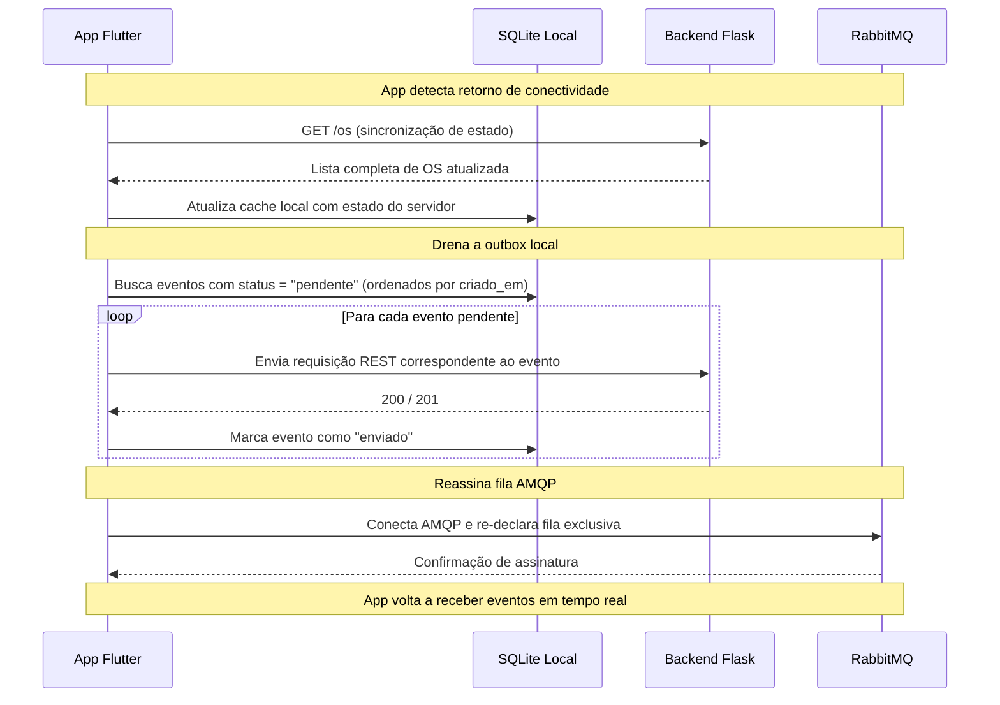
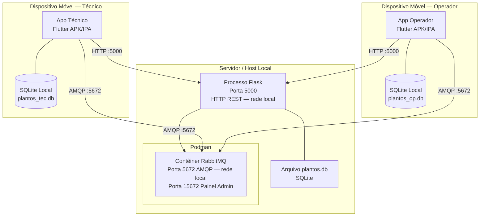
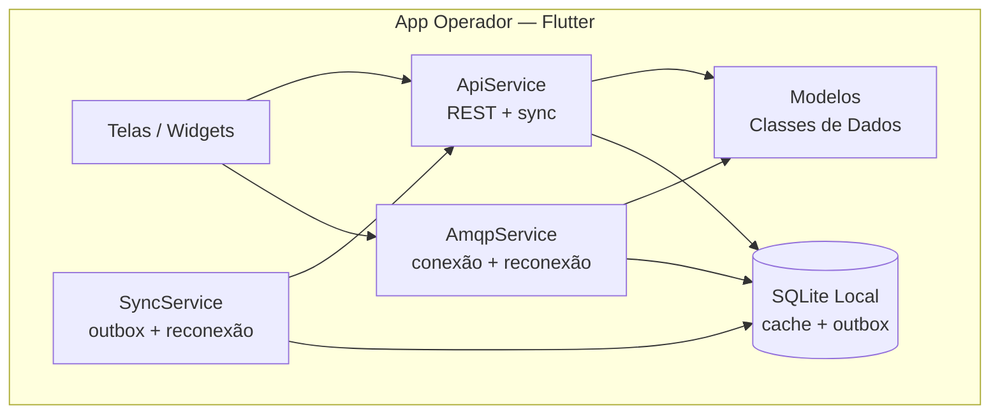
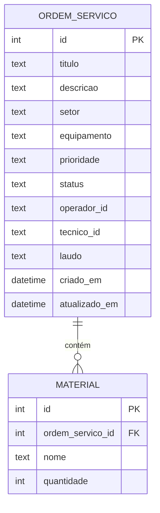
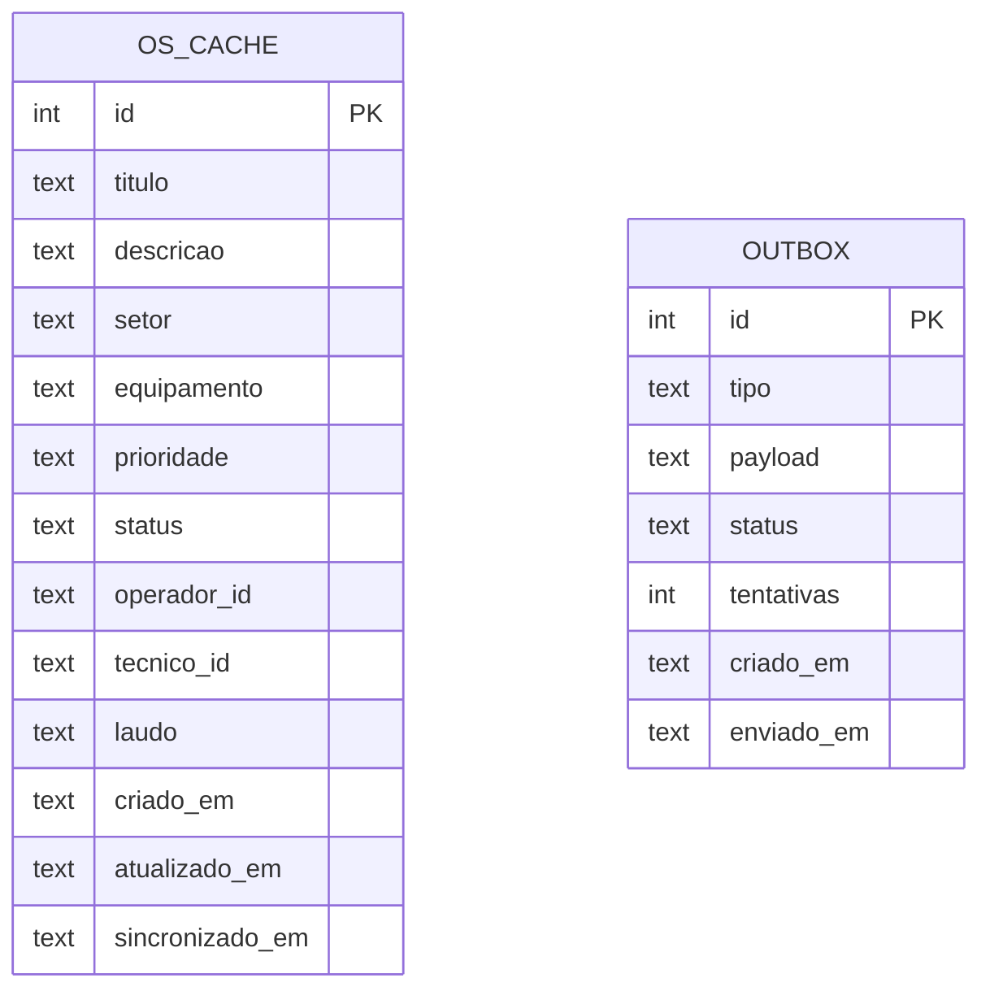
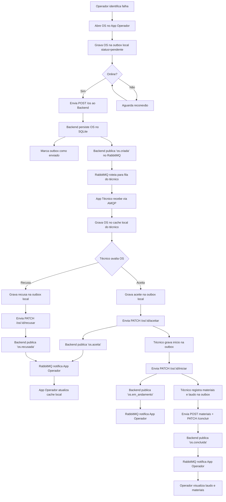

# Documento de Arquitetura — PlantOS

**Disciplina:** Lab. de Desenvolvimento de Aplicações Móveis e Distribuídas — PUC Minas  
**Curso:** Engenharia de Software — 5º Período  
**Semestre:** 1º Semestre 2026  
**Sprint:** 1 — Arquitetura e Backend REST

---

## 1. Visão Geral da Arquitetura

O PlantOS adota uma **Arquitetura Orientada a Eventos (Event-Driven Architecture — EDA)** com comunicação síncrona via REST e assíncrona via middleware de mensagens (RabbitMQ). O sistema é composto por quatro camadas principais:

1. **Camada de Apresentação** — Dois aplicativos móveis Flutter (Operador e Técnico)
2. **Camada de Serviço** — Backend REST em Flask (Python)
3. **Camada de Mensageria** — RabbitMQ como MOM (Message-Oriented Middleware)
4. **Camada de Persistência** — SQLite no backend e SQLite local em cada app (offline-first)

Os apps são **offline-first**: todas as ações do usuário são persistidas localmente antes de qualquer comunicação de rede. Um serviço de sincronização em background é responsável por drenar a fila local de eventos pendentes (Outbox Pattern) quando a conectividade é restaurada.

---

## 2. Diagrama de Arquitetura (Visão de Contêineres — C4 Level 2)



---

## 3. Diagrama de Componentes (Backend)



---

## 4. Diagrama de Fluxo de Eventos

```mermaid
sequenceDiagram
    participant Op as App Operador
    participant API as Backend Flask
    participant MQ as RabbitMQ
    participant Tec as App Técnico

    Note over Op,Tec: Fluxo 1 — Abertura de OS
    Op->>Op: Persiste OS no SQLite local (outbox: pendente)
    Op->>API: POST /os (título, descrição, setor, equipamento, prioridade)
    API->>API: Persiste OS no SQLite (status: aberta)
    API-->>Op: 201 Created
    Op->>Op: Marca outbox como enviado; atualiza cache local
    API->>MQ: Publish evento "os.criada"
    MQ-->>Tec: Entrega mensagem "os.criada" (via fila técnico)
    Tec->>Tec: Persiste OS no SQLite local (cache)

    Note over Op,Tec: Fluxo 2 — Aceite da OS
    Tec->>Tec: Persiste aceite no SQLite local (outbox: pendente)
    Tec->>API: PATCH /os/:id/aceitar (tecnico_id)
    API->>API: Atualiza status para "aceita"
    API-->>Tec: 200 OK
    Tec->>Tec: Marca outbox como enviado; atualiza cache local
    API->>MQ: Publish evento "os.aceita"
    MQ-->>Op: Entrega mensagem "os.aceita" (via fila operador)
    Op->>Op: Atualiza cache local

    Note over Op,Tec: Fluxo 3 — Início da execução
    Tec->>Tec: Persiste início no SQLite local (outbox: pendente)
    Tec->>API: PATCH /os/:id/iniciar (tecnico_id)
    API->>API: Atualiza status para "em_andamento"
    API-->>Tec: 200 OK
    Tec->>Tec: Marca outbox como enviado; atualiza cache local
    API->>MQ: Publish evento "os.em_andamento"
    MQ-->>Op: Entrega mensagem "os.em_andamento" (via fila operador)
    Op->>Op: Atualiza cache local

    Note over Op,Tec: Fluxo 4 — Registro de materiais e conclusão
    Tec->>Tec: Persiste materiais e laudo no SQLite local (outbox: pendente)
    Tec->>API: POST /os/:id/materiais (nome, quantidade)
    API-->>Tec: 201 Created
    Tec->>API: PATCH /os/:id/concluir (laudo)
    API->>API: Atualiza status para "concluída"
    API-->>Tec: 200 OK
    Tec->>Tec: Marca outbox como enviado; atualiza cache local
    API->>MQ: Publish evento "os.concluida"
    MQ-->>Op: Entrega mensagem "os.concluida" (via fila operador)
    Op->>Op: Atualiza cache local
```

---

## 5. Diagrama de Fluxo de Reconexão (Offline → Online)



---

## 6. Diagrama de Implantação



> **Nota de rede:** tanto a porta `5000` (Flask) quanto a porta `5672` (RabbitMQ AMQP) devem ser expostas na interface de rede local (`0.0.0.0`), e não apenas em `localhost`, para que os apps Flutter rodando em emuladores ou dispositivos físicos consigam alcançar o servidor.

> **Podman:** o RabbitMQ é executado via Podman (substituto rootless do Docker). O comando de inicialização é `podman run -d --name rabbitmq -p 5672:5672 -p 15672:15672 rabbitmq:3.12-management`. Não é necessário `podman-compose` para o escopo deste projeto.

---

## 7. Componentes Detalhados

### 7.1 App Operador (Flutter/Dart)

| Aspecto | Descrição |
|---|---|
| **Tecnologia** | Flutter 3.10+ / Dart 3.x |
| **Arquitetura interna** | Clean Architecture (models → services → screens) |
| **Comunicação síncrona** | HTTP REST (pacote `http` ou `dio`) |
| **Comunicação assíncrona** | Conexão AMQP direta com RabbitMQ via pacote `dart_amqp` |
| **Persistência local** | SQLite local via pacote `sqflite` — cache de OS e outbox de eventos pendentes |
| **Telas mínimas** | Lista de OS, Detalhes da OS, Criar nova OS |

**Camadas do app:**



**Estratégia de reconexão AMQP com backoff exponencial:**

```
ao detectar desconexão AMQP:
  tentativa 1 → aguarda 2s  → reconecta
  tentativa 2 → aguarda 4s  → reconecta
  tentativa 3 → aguarda 8s  → reconecta
  tentativa 4 → aguarda 16s → reconecta
  tentativa 5 → aguarda 32s → reconecta
  após 5 tentativas → notifica UI com indicador "offline"
```

Ao reconectar com sucesso:
1. `SyncService` chama `GET /os` para atualizar o cache local
2. `SyncService` drena a outbox (eventos `status = pendente`, ordenados por `criado_em`)
3. `AmqpService` re-declara a fila exclusiva e reassina o consumidor

### 7.2 App Técnico (Flutter/Dart)

| Aspecto | Descrição |
|---|---|
| **Tecnologia** | Flutter 3.10+ / Dart 3.x |
| **Arquitetura interna** | Clean Architecture (models → services → screens) |
| **Comunicação síncrona** | HTTP REST (pacote `http` ou `dio`) |
| **Comunicação assíncrona** | Conexão AMQP direta com RabbitMQ via pacote `dart_amqp` |
| **Persistência local** | SQLite local via pacote `sqflite` — cache de OS e outbox de eventos pendentes |
| **Telas mínimas** | Lista de OS pendentes, Detalhes (aceitar/recusar/iniciar), OS em andamento |

Mesma estratégia de reconexão, outbox e sync do App Operador.

### 7.3 Backend Flask (Python)

| Aspecto | Descrição |
|---|---|
| **Tecnologia** | Python 3.11+ / Flask |
| **Arquitetura interna** | Modular por responsabilidade (routes, services, models, messaging) |
| **Persistência** | SQLite via `sqlite3` nativo ou SQLAlchemy |
| **Mensageria** | Biblioteca `pika` para conexão AMQP com RabbitMQ |
| **Porta** | 5000 (HTTP, exposta em `0.0.0.0`) |

**Estrutura de módulos:**

```
backend/
├── app.py                    # Ponto de entrada, inicializa Flask app
├── requirements.txt          # Dependências (flask, pika, etc.)
└── app/
    ├── __init__.py           # Factory do app Flask
    ├── models/
    │   ├── __init__.py
    │   └── ordem_servico.py  # Modelos de dados + acesso ao banco
    ├── routes/
    │   ├── __init__.py
    │   └── os_routes.py      # Blueprints com endpoints REST
    ├── services/
    │   ├── __init__.py
    │   └── os_service.py     # Lógica de negócio
    └── messaging/
        ├── __init__.py
        └── publisher.py      # Publica eventos no RabbitMQ
```

### 7.4 RabbitMQ (MOM)

| Aspecto | Descrição |
|---|---|
| **Tecnologia** | RabbitMQ 3.12 com plugin Management |
| **Protocolo** | AMQP 0-9-1 |
| **Containerização** | Podman (rootless) |
| **Portas** | 5672 (AMQP, exposta em `0.0.0.0`), 15672 (Management UI) |
| **Credenciais dev** | guest / guest |

**Comando de inicialização:**

```bash
podman run -d \
  --name rabbitmq \
  -p 5672:5672 \
  -p 15672:15672 \
  rabbitmq:3.12-management
```

**Topologia de exchanges e filas:**

```mermaid
graph LR
    subgraph "RabbitMQ"
        EX[Exchange<br/>plantos.events<br/>tipo: direct]
        Q1[Fila Dinâmica<br/>queue_op_{id}<br/>Binding: op_{id}<br/>Exclusive: true<br/>Auto-delete: true]
        Q2[Fila Dinâmica<br/>queue_tec_{id}<br/>Binding: tec_{id}<br/>Exclusive: true<br/>Auto-delete: true]
    end

    PUB[Publicador Backend] -->|routing_key: op_{id} ou tec_{id}| EX
    EX -->|op_{id}| Q1
    EX -->|tec_{id}| Q2
    Q1 --> C1[App Operador<br/>Consumidor]
    Q2 --> C2[App Técnico<br/>Consumidor]
```

> **Sobre filas auto-delete:** mensagens publicadas enquanto o app está offline são perdidas na fila AMQP. Isso é mitigado pelo fluxo de reconexão: ao voltar online, o app faz `GET /os` para sincronizar o estado mais recente antes de reassinar o AMQP. A outbox local garante que ações feitas offline sejam enviadas ao servidor na ordem correta.

### 7.5 SQLite Local nos Apps (Offline-First)

Cada app mantém um banco SQLite local com duas responsabilidades:

**Cache de OS** — espelho local dos dados do servidor, atualizado via REST ao reconectar e via eventos AMQP em tempo real.

**Outbox de eventos** — fila persistente de ações realizadas pelo usuário enquanto offline, drenada ao servidor na reconexão.

**Schema do banco local (ambos os apps):**

```sql
-- Cache local das ordens de serviço
CREATE TABLE IF NOT EXISTS os_cache (
    id INTEGER PRIMARY KEY,
    titulo TEXT NOT NULL,
    descricao TEXT NOT NULL,
    setor TEXT NOT NULL,
    equipamento TEXT NOT NULL,
    prioridade TEXT NOT NULL,
    status TEXT NOT NULL,
    operador_id TEXT NOT NULL,
    tecnico_id TEXT,
    laudo TEXT,
    criado_em TEXT,
    atualizado_em TEXT,
    sincronizado_em TEXT  -- timestamp da última sync com o servidor
);

-- Outbox: ações pendentes de envio ao backend
CREATE TABLE IF NOT EXISTS outbox (
    id INTEGER PRIMARY KEY AUTOINCREMENT,
    tipo TEXT NOT NULL,         -- ex: "criar_os", "aceitar_os", "concluir_os"
    payload TEXT NOT NULL,      -- JSON com os dados da ação
    status TEXT NOT NULL DEFAULT 'pendente',  -- pendente | enviado | erro
    tentativas INTEGER DEFAULT 0,
    criado_em TEXT DEFAULT (datetime('now')),
    enviado_em TEXT
);
```

### 7.6 SQLite Backend

| Aspecto | Descrição |
|---|---|
| **Tecnologia** | SQLite 3.x |
| **Arquivo** | `backend/plantos.db` (criado automaticamente) |
| **Acesso** | Via `sqlite3` nativo do Python ou SQLAlchemy |
| **Tabelas** | `ordem_servico`, `material` |

---

## 8. Protocolos de Comunicação

| Origem | Destino | Protocolo | Porta | Formato | Descrição |
|---|---|---|---|---|---|
| App Operador | Backend Flask | HTTP/1.1 REST | 5000 | JSON | Operações CRUD sobre OS + sync ao reconectar |
| App Técnico | Backend Flask | HTTP/1.1 REST | 5000 | JSON | Aceite, recusa, início, conclusão + sync ao reconectar |
| Backend Flask | RabbitMQ | AMQP 0-9-1 | 5672 | JSON | Publicação de eventos |
| App Operador | RabbitMQ | AMQP 0-9-1 | 5672 | JSON | Assinatura direta de fila exclusiva |
| App Técnico | RabbitMQ | AMQP 0-9-1 | 5672 | JSON | Assinatura direta de fila exclusiva |
| Backend Flask | SQLite (servidor) | File I/O | — | SQL | Persistência de dados do servidor |
| App Operador | SQLite (local) | File I/O | — | SQL | Cache offline + outbox de eventos |
| App Técnico | SQLite (local) | File I/O | — | SQL | Cache offline + outbox de eventos |

---

## 9. Modelo de Eventos (Mensageria)

### 9.1 Configuração do RabbitMQ

- **Exchange:** `plantos.events` (type: `direct`, durable: true)
- **Filas:**
  - `fila.operador` — Recebe eventos destinados ao operador
  - `fila.tecnico` — Recebe eventos destinados ao técnico
- **Bindings:**
  - `fila.tecnico` ← routing key `os.criada`
  - `fila.operador` ← routing keys `os.aceita`, `os.recusada`, `os.em_andamento`, `os.concluida`

### 9.2 Payloads dos Eventos

#### Evento `os.criada`

```json
{
  "evento": "os.criada",
  "timestamp": "2026-05-02T14:30:00Z",
  "dados": {
    "id": 1,
    "titulo": "Vazamento na válvula V-102",
    "descricao": "Vazamento de óleo identificado na válvula de controle V-102 do setor de caldeiras",
    "setor": "Caldeiras",
    "equipamento": "Válvula V-102",
    "prioridade": "alta",
    "status": "aberta",
    "operador_id": "op-001",
    "criado_em": "2026-05-02T14:30:00Z"
  }
}
```

#### Evento `os.aceita`

```json
{
  "evento": "os.aceita",
  "timestamp": "2026-05-02T14:35:00Z",
  "dados": {
    "id": 1,
    "titulo": "Vazamento na válvula V-102",
    "status": "aceita",
    "tecnico_id": "tec-003",
    "atualizado_em": "2026-05-02T14:35:00Z"
  }
}
```

#### Evento `os.recusada`

```json
{
  "evento": "os.recusada",
  "timestamp": "2026-05-02T14:35:00Z",
  "dados": {
    "id": 1,
    "titulo": "Vazamento na válvula V-102",
    "status": "recusada",
    "tecnico_id": "tec-003",
    "atualizado_em": "2026-05-02T14:35:00Z"
  }
}
```

#### Evento `os.em_andamento`

```json
{
  "evento": "os.em_andamento",
  "timestamp": "2026-05-02T15:00:00Z",
  "dados": {
    "id": 1,
    "titulo": "Vazamento na válvula V-102",
    "status": "em_andamento",
    "tecnico_id": "tec-003",
    "atualizado_em": "2026-05-02T15:00:00Z"
  }
}
```

#### Evento `os.concluida`

```json
{
  "evento": "os.concluida",
  "timestamp": "2026-05-02T17:00:00Z",
  "dados": {
    "id": 1,
    "titulo": "Vazamento na válvula V-102",
    "status": "concluida",
    "tecnico_id": "tec-003",
    "laudo": "Substituição da gaxeta da válvula V-102. Teste de pressão realizado com sucesso.",
    "materiais": [
      {"nome": "Gaxeta 3/4\"", "quantidade": 2},
      {"nome": "Anel O-Ring", "quantidade": 4}
    ],
    "atualizado_em": "2026-05-02T17:00:00Z"
  }
}
```

---

## 10. Endpoints REST — Especificação Detalhada

### 10.1 Criar Ordem de Serviço

```
POST /os
Content-Type: application/json

Request Body:
{
  "titulo": "Vazamento na válvula V-102",
  "descricao": "Vazamento de óleo identificado na válvula de controle V-102",
  "setor": "Caldeiras",
  "equipamento": "Válvula V-102",
  "prioridade": "alta",
  "operador_id": "op-001"
}

Response: 201 Created
{
  "id": 1,
  "titulo": "Vazamento na válvula V-102",
  "descricao": "Vazamento de óleo identificado na válvula de controle V-102",
  "setor": "Caldeiras",
  "equipamento": "Válvula V-102",
  "prioridade": "alta",
  "status": "aberta",
  "operador_id": "op-001",
  "tecnico_id": null,
  "laudo": null,
  "criado_em": "2026-05-02T14:30:00Z",
  "atualizado_em": "2026-05-02T14:30:00Z"
}
```

### 10.2 Listar Ordens de Serviço

```
GET /os
GET /os?status=aberta
GET /os?operador_id=op-001

Response: 200 OK
[
  {
    "id": 1,
    "titulo": "Vazamento na válvula V-102",
    "status": "aberta",
    "prioridade": "alta",
    "setor": "Caldeiras",
    "criado_em": "2026-05-02T14:30:00Z"
  }
]
```

### 10.3 Consultar OS por ID

```
GET /os/:id

Response: 200 OK
{
  "id": 1,
  "titulo": "Vazamento na válvula V-102",
  "descricao": "Vazamento de óleo identificado...",
  "setor": "Caldeiras",
  "equipamento": "Válvula V-102",
  "prioridade": "alta",
  "status": "aberta",
  "operador_id": "op-001",
  "tecnico_id": null,
  "laudo": null,
  "criado_em": "2026-05-02T14:30:00Z",
  "atualizado_em": "2026-05-02T14:30:00Z"
}
```

### 10.4 Aceitar OS

```
PATCH /os/:id/aceitar
Content-Type: application/json

Request Body:
{
  "tecnico_id": "tec-003"
}

Response: 200 OK
{
  "id": 1,
  "status": "aceita",
  "tecnico_id": "tec-003",
  "atualizado_em": "2026-05-02T14:35:00Z"
}
```

### 10.5 Recusar OS

```
PATCH /os/:id/recusar
Content-Type: application/json

Request Body:
{
  "tecnico_id": "tec-003"
}

Response: 200 OK
{
  "id": 1,
  "status": "recusada",
  "atualizado_em": "2026-05-02T14:35:00Z"
}
```

### 10.6 Iniciar OS

```
PATCH /os/:id/iniciar
Content-Type: application/json

Request Body:
{
  "tecnico_id": "tec-003"
}

Response: 200 OK
{
  "id": 1,
  "status": "em_andamento",
  "tecnico_id": "tec-003",
  "atualizado_em": "2026-05-02T15:00:00Z"
}
```

### 10.7 Concluir OS

```
PATCH /os/:id/concluir
Content-Type: application/json

Request Body:
{
  "tecnico_id": "tec-003",
  "laudo": "Substituição da gaxeta da válvula V-102. Teste de pressão realizado com sucesso."
}

Response: 200 OK
{
  "id": 1,
  "status": "concluida",
  "laudo": "Substituição da gaxeta...",
  "atualizado_em": "2026-05-02T17:00:00Z"
}
```

### 10.8 Registrar Materiais

```
POST /os/:id/materiais
Content-Type: application/json

Request Body:
{
  "nome": "Gaxeta 3/4\"",
  "quantidade": 2
}

Response: 201 Created
{
  "id": 1,
  "ordem_servico_id": 1,
  "nome": "Gaxeta 3/4\"",
  "quantidade": 2
}
```

### 10.9 Listar Materiais de uma OS

```
GET /os/:id/materiais

Response: 200 OK
[
  {"id": 1, "nome": "Gaxeta 3/4\"", "quantidade": 2},
  {"id": 2, "nome": "Anel O-Ring", "quantidade": 4}
]
```

---

## 11. Modelo de Dados — Backend (Schema SQLite)

```sql
CREATE TABLE IF NOT EXISTS ordem_servico (
    id INTEGER PRIMARY KEY AUTOINCREMENT,
    titulo TEXT NOT NULL,
    descricao TEXT NOT NULL,
    setor TEXT NOT NULL,
    equipamento TEXT NOT NULL,
    prioridade TEXT NOT NULL CHECK(prioridade IN ('baixa', 'media', 'alta', 'critica')),
    status TEXT NOT NULL DEFAULT 'aberta' CHECK(status IN ('aberta', 'aceita', 'em_andamento', 'concluida', 'recusada')),
    operador_id TEXT NOT NULL,
    tecnico_id TEXT,
    laudo TEXT,
    criado_em DATETIME DEFAULT CURRENT_TIMESTAMP,
    atualizado_em DATETIME DEFAULT CURRENT_TIMESTAMP
);

CREATE TABLE IF NOT EXISTS material (
    id INTEGER PRIMARY KEY AUTOINCREMENT,
    ordem_servico_id INTEGER NOT NULL,
    nome TEXT NOT NULL,
    quantidade INTEGER NOT NULL CHECK(quantidade > 0),
    FOREIGN KEY (ordem_servico_id) REFERENCES ordem_servico(id)
);
```

### Diagrama ER — Backend



### Diagrama ER — SQLite Local (Apps)



---

## 12. Máquina de Estados — Ordem de Serviço


**Regras de transição:**
- Apenas OS com status `aberta` podem ser aceitas ou recusadas
- Apenas OS com status `aceita` podem passar para `em_andamento`
- Apenas OS com status `em_andamento` podem ser concluídas
- Conclusão exige um laudo técnico preenchido
- Todas as transições são primeiro gravadas na outbox local, depois enviadas ao backend

---

## 13. Decisões Arquiteturais

| Decisão | Justificativa |
|---|---|
| **Flask (Python)** como backend | Microframework leve, curva de aprendizado baixa, ideal para APIs REST de porte médio |
| **SQLite** como banco do servidor | Embutido no Python, não requer servidor separado, suficiente para o escopo do projeto |
| **RabbitMQ** como MOM | Broker robusto com suporte nativo a AMQP |
| **Exchange tipo direct** | Permite roteamento 1-a-1 via *routing_keys* direcionadas aos IDs dos usuários |
| **Filas dinâmicas exclusivas** | Filas `auto-delete + exclusive` são criadas por conexão ativa; o estado é sempre recuperado via REST ao reconectar |
| **AMQP direto nos apps Flutter** | Fidelidade máxima à EDA; apps assinam filas diretamente no broker sem polling, atendendo o requisito de notificação assíncrona sem polling contínuo |
| **Offline-first com SQLite local** | Apps funcionam sem rede; ações são persistidas na outbox local e sincronizadas ao servidor quando a conexão é restaurada |
| **Outbox Pattern** | Garante que nenhuma ação do usuário seja perdida por falta de conectividade; a ordem de envio é preservada pelo campo `criado_em` |
| **Sync REST ao reconectar** | Como filas AMQP são `auto-delete`, ao voltar online o app faz `GET /os` para recuperar o estado atual antes de reassinar o AMQP |
| **Reconexão com backoff exponencial** | Mitiga a ausência de reconexão automática no `dart_amqp` em cenários de queda de rede ou retorno do background |
| **Podman** para RabbitMQ | Alternativa rootless ao Docker; sem necessidade de daemon privilegiado; comando equivalente ao Docker |
| **Portas expostas em `0.0.0.0`** | Necessário para que apps em emuladores ou dispositivos físicos alcancem Flask e RabbitMQ no host |
| **Clean Architecture nos apps** | Separação de responsabilidades (models/services/screens) facilita manutenção e testes |

---

## 14. Fluxo Completo — Ponta a Ponta



---

## 15. Requisitos Não-Funcionais

| Requisito | Descrição |
|---|---|
| **Disponibilidade offline** | Apps funcionam sem conectividade; ações são gravadas localmente e sincronizadas ao reconectar |
| **Consistência eventual** | O estado dos apps converge com o servidor após a sincronização REST + drenagem da outbox |
| **Desacoplamento** | Apps não dependem diretamente um do outro; toda comunicação passa pelo backend + MOM |
| **Latência de eventos (online)** | Eventos entregues quase instantaneamente via conexão AMQP contínua |
| **Resiliência de conexão** | Backoff exponencial (até 5 tentativas); após reconectar, sync REST + drain outbox garantem consistência |
| **Ordem de eventos** | A outbox preserva a ordem de criação das ações pelo campo `criado_em` |
| **Portabilidade** | Podman garante ambiente reproduzível sem necessidade de daemon privilegiado |
| **Acessibilidade de rede** | Flask (porta 5000) e RabbitMQ (porta 5672) expostos em `0.0.0.0` para acesso por emuladores e dispositivos físicos na rede local |

---

## 16. Tecnologias e Dependências

### Backend (Python)

| Pacote | Versão | Uso |
|---|---|---|
| `flask` | ≥3.0 | Framework web REST |
| `pika` | ≥1.3 | Cliente AMQP para RabbitMQ |
| `flask-cors` | ≥4.0 | Habilitar CORS para apps móveis |

### Apps Flutter

| Pacote | Uso |
|---|---|
| `http` ou `dio` | Requisições HTTP REST |
| `dart_amqp` | Conexão AMQP direta com RabbitMQ |
| `sqflite` | SQLite local — cache de OS e outbox de eventos |
| `connectivity_plus` | Detecção de mudanças de conectividade para acionar sync |
| `provider` ou `riverpod` | Gerenciamento de estado |

### Infraestrutura

| Ferramenta | Versão | Uso |
|---|---|---|
| Podman | ≥4.x | Containerização rootless do RabbitMQ |
| RabbitMQ | 3.12-management | Message broker + painel de administração |