# Documento de Arquitetura — PlantOS

**Disciplina:** Lab. de Desenvolvimento de Aplicações Móveis e Distribuídas — PUC Minas  
**Curso:** Engenharia de Software — 5º Período  
**Semestre:** 1º Semestre 2026  
**Sprint:** 1 — Arquitetura e Backend REST

---

## 1. Visão Geral da Arquitetura

O PlantOS adota uma **Arquitetura Orientada a Eventos (Event-Driven Architecture — EDA)** com comunicação síncrona via REST e assíncrona via middleware de mensagens (RabbitMQ). O sistema é composto por quatro camadas principais:

1. **Camada de Apresentação** — Dois aplicativos móveis Flutter (Operador e Técnico)
2. **Camada de Serviço** — Backend REST em Flask (Python)
3. **Camada de Mensageria** — RabbitMQ como MOM (Message-Oriented Middleware)
4. **Camada de Persistência** — SQLite no backend e SQLite local em cada app (offline-first)

Os apps são **offline-first**: todas as ações do usuário são persistidas localmente antes de qualquer comunicação de rede. Um serviço de sincronização em background é responsável por drenar a fila local de eventos pendentes (Outbox Pattern) quando a conectividade é restaurada.

---

## 2. Diagrama de Arquitetura (Visão de Contêineres — C4 Level 2)

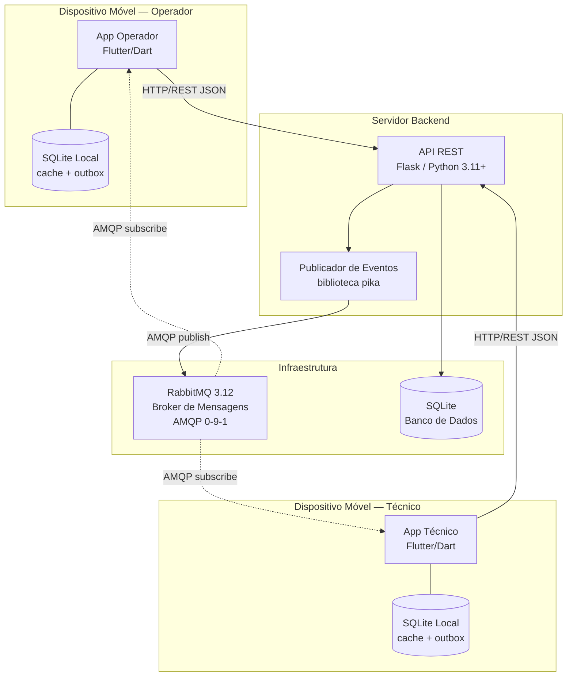

---

## 3. Diagrama de Componentes (Backend)

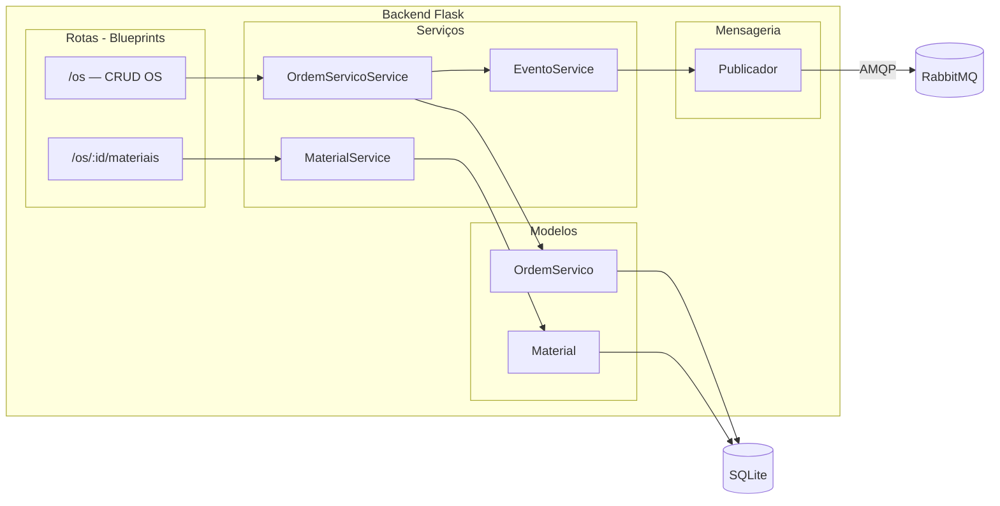

---

## 4. Diagrama de Fluxo de Eventos

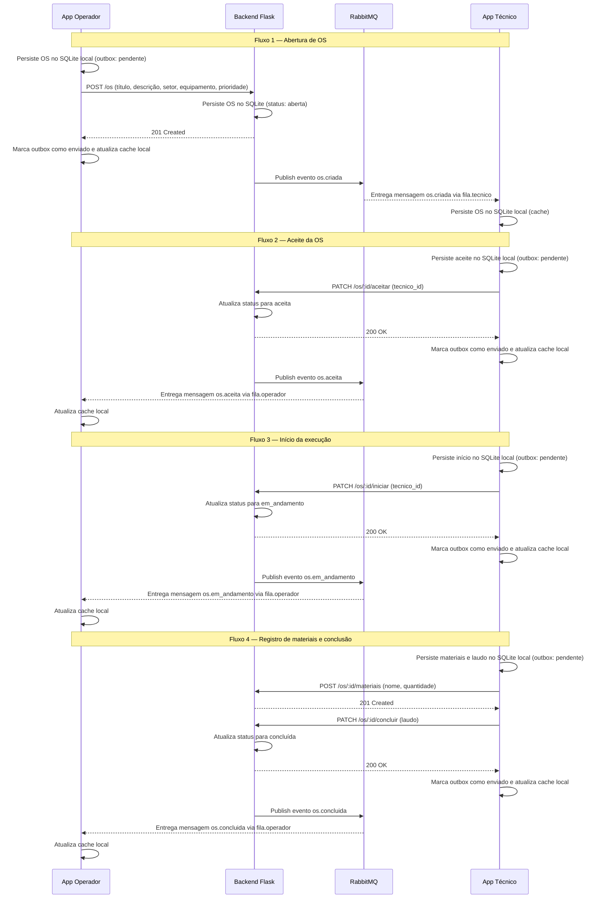

---

## 5. Diagrama de Fluxo de Reconexão (Offline → Online)

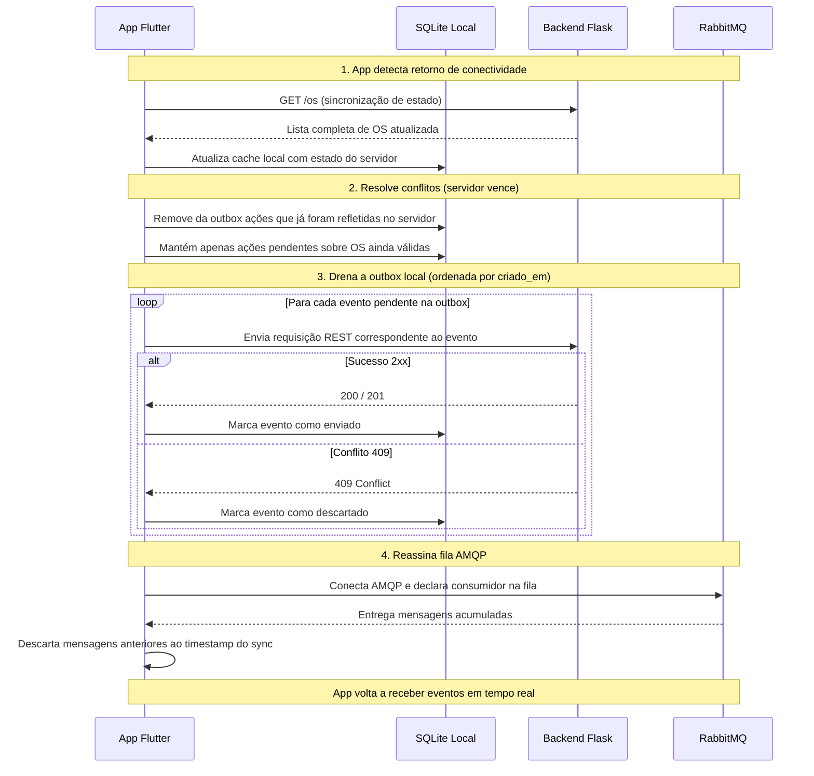

---

## 6. Diagrama de Implantação

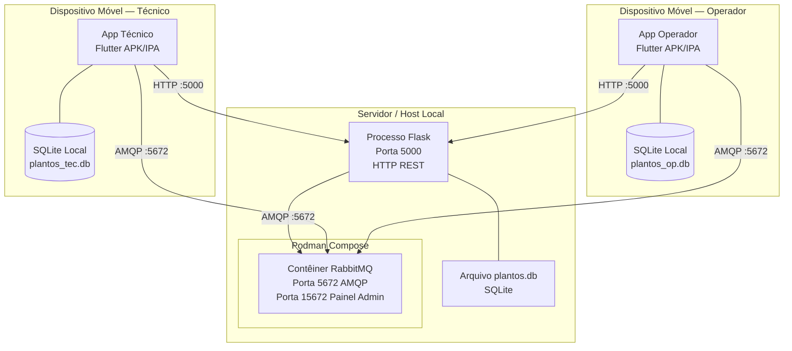

> **Nota de rede:** tanto a porta `5000` (Flask) quanto a porta `5672` (RabbitMQ AMQP) devem ser expostas na interface de rede local (`0.0.0.0`), para que os apps Flutter rodando em emuladores ou dispositivos físicos consigam alcançar o servidor.

---

## 7. Componentes Detalhados

### 7.1 App Operador (Flutter/Dart)

| Aspecto | Descrição |
|---|---|
| **Tecnologia** | Flutter 3.10+ / Dart 3.x |
| **Arquitetura interna** | Clean Architecture (models → services → screens) |
| **Comunicação síncrona** | HTTP REST (pacote `http` ou `dio`) |
| **Comunicação assíncrona** | Conexão AMQP direta com RabbitMQ via pacote `dart_amqp` |
| **Persistência local** | SQLite local via pacote `sqflite` — cache de OS e outbox de eventos pendentes |
| **Telas mínimas** | Lista de OS, Detalhes da OS, Criar nova OS |

**Camadas do app:**

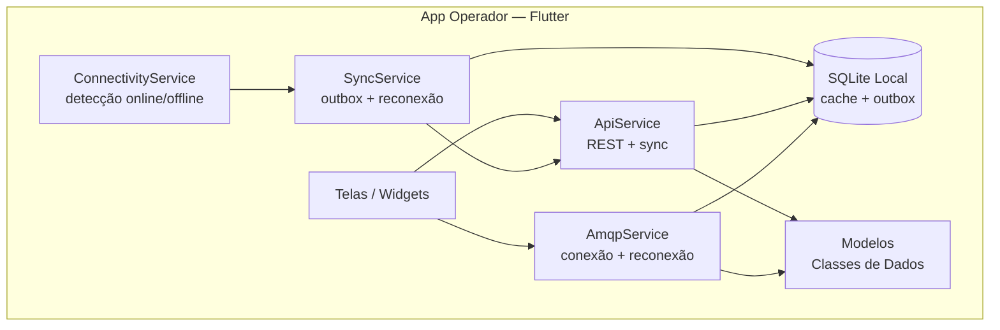

### 7.2 App Técnico (Flutter/Dart)

| Aspecto | Descrição |
|---|---|
| **Tecnologia** | Flutter 3.10+ / Dart 3.x |
| **Arquitetura interna** | Clean Architecture (models → services → screens) |
| **Comunicação síncrona** | HTTP REST (pacote `http` ou `dio`) |
| **Comunicação assíncrona** | Conexão AMQP direta com RabbitMQ via pacote `dart_amqp` |
| **Persistência local** | SQLite local via pacote `sqflite` — cache de OS e outbox de eventos pendentes |
| **Telas mínimas** | Lista de OS pendentes, Detalhes (aceitar/recusar/iniciar), OS em andamento |

Mesma estratégia de reconexão, outbox e sync do App Operador.

### 7.3 Backend Flask (Python)

| Aspecto | Descrição |
|---|---|
| **Tecnologia** | Python 3.11+ / Flask |
| **Arquitetura interna** | Modular por responsabilidade (routes, services, models, messaging) |
| **Persistência** | SQLite via `sqlite3` nativo |
| **Mensageria** | Biblioteca `pika` para conexão AMQP com RabbitMQ |
| **Porta** | 5000 (HTTP, exposta em `0.0.0.0`) |

**Estrutura de módulos:**

```
backend/
├── app.py                    # Ponto de entrada, inicializa Flask app
├── requirements.txt          # Dependências (flask, pika, etc.)
└── app/
    ├── database.py           # Conexão com SQLite + init_db()
    ├── models/
    │   ├── __init__.py
    │   ├── ordem_servico.py  # Modelo OrdemServico + acesso ao banco
    │   └── material.py       # Modelo Material + acesso ao banco
    ├── routes/
    │   ├── __init__.py
    │   └── os_routes.py      # Blueprints com endpoints REST
    ├── services/
    │   ├── __init__.py
    │   └── os_service.py     # Lógica de negócio
    └── messaging/
        ├── __init__.py
        └── publisher.py      # Publica eventos no RabbitMQ
```

### 7.4 RabbitMQ (MOM)

| Aspecto | Descrição |
|---|---|
| **Tecnologia** | RabbitMQ 3.12 com plugin Management |
| **Protocolo** | AMQP 0-9-1 |
| **Containerização** | Podman Compose |
| **Portas** | 5672 (AMQP), 15672 (Management UI) |
| **Credenciais dev** | guest / guest |

**Topologia de exchanges e filas:**

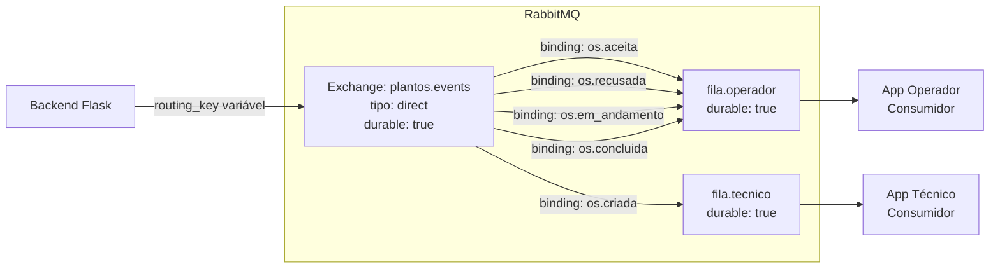

**Decisão: filas duráveis com mensagens persistentes**

Usamos filas **duráveis** com **mensagens persistentes** (delivery_mode=2). Isso garante que mensagens publicadas enquanto o app está offline **não são perdidas** — ficam armazenadas no RabbitMQ aguardando o consumidor reconectar.

Ao reconectar, o app:
1. Primeiro faz `GET /os` para obter o estado completo e atualizado do servidor
2. Depois reconecta ao AMQP e consome as mensagens acumuladas
3. **Descarta mensagens com timestamp anterior ao sync REST** (pois representam estados intermediários já superados)
4. A partir daí, novas mensagens AMQP são processadas normalmente como notificações em tempo real

> **Por que descartar as mensagens antigas?** Porque após um período offline longo, as mensagens na fila representam estados intermediários que já foram superados. O `GET /os` traz o estado final correto. Processar mensagens antigas causaria transições de UI desnecessárias.

### 7.5 SQLite Local nos Apps (Offline-First)

Cada app mantém um banco SQLite local com duas responsabilidades:

**Cache de OS** — espelho local dos dados do servidor, atualizado via REST ao reconectar e via eventos AMQP em tempo real.

**Outbox de eventos** — fila persistente de ações realizadas pelo usuário enquanto offline, drenada ao servidor na reconexão.

**Schema do banco local (ambos os apps):**

```sql
-- Cache local das ordens de serviço
CREATE TABLE IF NOT EXISTS os_cache (
    id INTEGER PRIMARY KEY,
    titulo TEXT NOT NULL,
    descricao TEXT NOT NULL,
    setor TEXT NOT NULL,
    equipamento TEXT NOT NULL,
    prioridade TEXT NOT NULL,
    status TEXT NOT NULL,
    operador_id TEXT NOT NULL,
    tecnico_id TEXT,
    laudo TEXT,
    criado_em TEXT,
    atualizado_em TEXT,
    sincronizado_em TEXT  -- timestamp da última sync com o servidor
);

-- Cache local de materiais
CREATE TABLE IF NOT EXISTS material_cache (
    id INTEGER PRIMARY KEY,
    ordem_servico_id INTEGER NOT NULL,
    nome TEXT NOT NULL,
    quantidade INTEGER NOT NULL
);

-- Outbox: ações pendentes de envio ao backend
CREATE TABLE IF NOT EXISTS outbox (
    id INTEGER PRIMARY KEY AUTOINCREMENT,
    tipo TEXT NOT NULL,         -- ex: "criar_os", "aceitar_os", "iniciar_os", "concluir_os", "registrar_material"
    payload TEXT NOT NULL,      -- JSON com os dados da ação
    os_id INTEGER,             -- ID da OS relacionada (null para criação)
    status TEXT NOT NULL DEFAULT 'pendente',  -- pendente | enviado | descartado | erro
    tentativas INTEGER DEFAULT 0,
    criado_em TEXT DEFAULT (datetime('now')),
    enviado_em TEXT
);
```

### 7.6 SQLite Backend

| Aspecto | Descrição |
|---|---|
| **Tecnologia** | SQLite 3.x |
| **Arquivo** | `backend/plantos.db` (criado automaticamente) |
| **Acesso** | Via `sqlite3` nativo do Python |
| **Tabelas** | `ordem_servico`, `material` |

---

## 8. Estratégia Offline-First e Sincronização

### 8.1 Princípio Fundamental

> **Toda ação do usuário é gravada localmente PRIMEIRO, depois enviada ao servidor quando possível.**

Isso permite que o sistema funcione normalmente sem conectividade por tempo indeterminado (dias, semanas ou meses).

### 8.2 Detecção de Conectividade

O app usa o pacote `connectivity_plus` para monitorar mudanças de rede. Adicionalmente, faz um health check HTTP periódico (`GET /os` com timeout de 5s) para confirmar que o backend está realmente acessível.

```
Estados de conectividade:
  ONLINE   → REST + AMQP funcionando normalmente
  OFFLINE  → Apenas SQLite local; ações vão para outbox
```

### 8.3 Fluxo de Reconexão (Sync-First Strategy)

Quando o app detecta retorno de conectividade após um período offline:

```
┌─────────────────────────────────────────────────────────────────┐
│  PASSO 1: PULL — Sincronizar estado do servidor                 │
│  GET /os → atualiza os_cache com o estado autoritativo          │
│  (servidor sempre vence em caso de conflito)                    │
├─────────────────────────────────────────────────────────────────┤
│  PASSO 2: RECONCILE — Filtrar outbox                            │
│  Para cada item pendente na outbox:                             │
│    - Se a OS no servidor já passou do estado que a ação tenta   │
│      aplicar → marca como "descartado" (conflito resolvido)     │
│    - Se a ação ainda é válida → mantém como "pendente"          │
├─────────────────────────────────────────────────────────────────┤
│  PASSO 3: PUSH — Drenar outbox (em ordem cronológica)           │
│  Para cada ação pendente (ORDER BY criado_em ASC):              │
│    - Envia a requisição REST ao backend                         │
│    - Se 2xx → marca como "enviado"                              │
│    - Se 409 (conflito) → marca como "descartado"               │
│    - Se 5xx ou timeout → mantém como "pendente", para e         │
│      tenta na próxima rodada (preserva ordem)                   │
├─────────────────────────────────────────────────────────────────┤
│  PASSO 4: SUBSCRIBE — Reconectar AMQP                           │
│  - Conecta ao RabbitMQ e consome a fila durável                 │
│  - Descarta mensagens com timestamp anterior ao sync do Passo 1 │
│  - Processa normalmente mensagens novas (atualiza cache + UI)   │
└─────────────────────────────────────────────────────────────────┘
```

### 8.4 Estratégia de Reconexão AMQP (Backoff Exponencial)

```
Ao detectar desconexão AMQP:
  tentativa 1 → aguarda 2s  → reconecta
  tentativa 2 → aguarda 4s  → reconecta
  tentativa 3 → aguarda 8s  → reconecta
  tentativa 4 → aguarda 16s → reconecta
  tentativa 5 → aguarda 32s → reconecta
  após 5 tentativas → notifica UI com indicador "offline"
  continua tentando a cada 60s em background
```

### 8.5 Regras de Conflito

| Situação | Resolução |
|---|---|
| App tenta aceitar OS que já foi aceita por outro técnico | Backend retorna 409; outbox marca como descartado |
| App tenta concluir OS que já foi concluída | Backend retorna 409; outbox marca como descartado |
| App cria OS offline, servidor estava indisponível | Na reconexão, POST é enviado normalmente — sem conflito |
| Múltiplas ações offline na mesma OS | Enviadas em ordem cronológica; backend valida cada transição |
| Erro 5xx durante drain da outbox | Para o drain, tenta novamente na próxima rodada |

### 8.6 Garantias do Sistema

| Garantia | Mecanismo |
|---|---|
| Nenhuma ação do usuário é perdida | Outbox persiste em SQLite local |
| Ordem de ações preservada | Campo `criado_em` na outbox + envio ordenado |
| Estado consistente após reconexão | Sync-first (GET /os) antes de drenar outbox |
| Sem duplicação de ações | Backend valida transições de estado (máquina de estados) |
| Tolerância a offline prolongado | Filas AMQP duráveis + outbox local sem expiração |

---

## 9. Modelo de Eventos (Mensageria)

### 9.1 Configuração do RabbitMQ

- **Exchange:** `plantos.events` (type: `direct`, durable: true)
- **Filas:**
  - `fila.operador` — durable: true — Recebe eventos destinados ao operador
  - `fila.tecnico` — durable: true — Recebe eventos destinados ao técnico
- **Bindings:**
  - `fila.tecnico` ← routing key `os.criada`
  - `fila.operador` ← routing keys `os.aceita`, `os.recusada`, `os.em_andamento`, `os.concluida`
- **Mensagens:** delivery_mode=2 (persistente), content_type=application/json

### 9.2 Payloads dos Eventos

#### Evento `os.criada`

```json
{
  "evento": "os.criada",
  "timestamp": "2026-05-02T14:30:00Z",
  "dados": {
    "id": 1,
    "titulo": "Vazamento na válvula V-102",
    "descricao": "Vazamento de óleo identificado na válvula de controle V-102 do setor de caldeiras",
    "setor": "Caldeiras",
    "equipamento": "Válvula V-102",
    "prioridade": "alta",
    "status": "aberta",
    "operador_id": "op-001",
    "criado_em": "2026-05-02T14:30:00Z"
  }
}
```

#### Evento `os.aceita`

```json
{
  "evento": "os.aceita",
  "timestamp": "2026-05-02T14:35:00Z",
  "dados": {
    "id": 1,
    "titulo": "Vazamento na válvula V-102",
    "status": "aceita",
    "tecnico_id": "tec-003",
    "atualizado_em": "2026-05-02T14:35:00Z"
  }
}
```

#### Evento `os.recusada`

```json
{
  "evento": "os.recusada",
  "timestamp": "2026-05-02T14:35:00Z",
  "dados": {
    "id": 1,
    "titulo": "Vazamento na válvula V-102",
    "status": "recusada",
    "tecnico_id": "tec-003",
    "atualizado_em": "2026-05-02T14:35:00Z"
  }
}
```

#### Evento `os.em_andamento`

```json
{
  "evento": "os.em_andamento",
  "timestamp": "2026-05-02T15:00:00Z",
  "dados": {
    "id": 1,
    "titulo": "Vazamento na válvula V-102",
    "status": "em_andamento",
    "tecnico_id": "tec-003",
    "atualizado_em": "2026-05-02T15:00:00Z"
  }
}
```

#### Evento `os.concluida`

```json
{
  "evento": "os.concluida",
  "timestamp": "2026-05-02T17:00:00Z",
  "dados": {
    "id": 1,
    "titulo": "Vazamento na válvula V-102",
    "status": "concluida",
    "tecnico_id": "tec-003",
    "laudo": "Substituição da gaxeta da válvula V-102. Teste de pressão realizado com sucesso.",
    "materiais": [
      {"nome": "Gaxeta 3/4\"", "quantidade": 2},
      {"nome": "Anel O-Ring", "quantidade": 4}
    ],
    "atualizado_em": "2026-05-02T17:00:00Z"
  }
}
```

---

## 10. Endpoints REST — Especificação Detalhada

### 10.1 Criar Ordem de Serviço

```
POST /os
Content-Type: application/json

Request Body:
{
  "titulo": "Vazamento na válvula V-102",
  "descricao": "Vazamento de óleo identificado na válvula de controle V-102",
  "setor": "Caldeiras",
  "equipamento": "Válvula V-102",
  "prioridade": "alta",
  "operador_id": "op-001"
}

Response: 201 Created
{
  "id": 1,
  "titulo": "Vazamento na válvula V-102",
  "descricao": "Vazamento de óleo identificado na válvula de controle V-102",
  "setor": "Caldeiras",
  "equipamento": "Válvula V-102",
  "prioridade": "alta",
  "status": "aberta",
  "operador_id": "op-001",
  "tecnico_id": null,
  "laudo": null,
  "criado_em": "2026-05-02T14:30:00Z",
  "atualizado_em": "2026-05-02T14:30:00Z"
}
```

### 10.2 Listar Ordens de Serviço

```
GET /os
GET /os?status=aberta
GET /os?operador_id=op-001

Response: 200 OK
[
  {
    "id": 1,
    "titulo": "Vazamento na válvula V-102",
    "descricao": "Vazamento de óleo identificado...",
    "setor": "Caldeiras",
    "equipamento": "Válvula V-102",
    "prioridade": "alta",
    "status": "aberta",
    "operador_id": "op-001",
    "tecnico_id": null,
    "laudo": null,
    "criado_em": "2026-05-02T14:30:00Z",
    "atualizado_em": "2026-05-02T14:30:00Z"
  }
]
```

### 10.3 Consultar OS por ID

```
GET /os/:id

Response: 200 OK
{
  "id": 1,
  "titulo": "Vazamento na válvula V-102",
  "descricao": "Vazamento de óleo identificado...",
  "setor": "Caldeiras",
  "equipamento": "Válvula V-102",
  "prioridade": "alta",
  "status": "aberta",
  "operador_id": "op-001",
  "tecnico_id": null,
  "laudo": null,
  "criado_em": "2026-05-02T14:30:00Z",
  "atualizado_em": "2026-05-02T14:30:00Z"
}
```

### 10.4 Aceitar OS

```
PATCH /os/:id/aceitar
Content-Type: application/json

Request Body:
{
  "tecnico_id": "tec-003"
}

Response: 200 OK
{
  "id": 1,
  "status": "aceita",
  "tecnico_id": "tec-003",
  "atualizado_em": "2026-05-02T14:35:00Z"
}

Response: 409 Conflict (se OS não está com status "aberta")
{
  "erro": "Transição inválida. Status atual: aceita. Esperado: aberta"
}
```

### 10.5 Recusar OS

```
PATCH /os/:id/recusar
Content-Type: application/json

Request Body:
{
  "tecnico_id": "tec-003"
}

Response: 200 OK
{
  "id": 1,
  "status": "recusada",
  "atualizado_em": "2026-05-02T14:35:00Z"
}

Response: 409 Conflict (se OS não está com status "aberta")
{
  "erro": "Transição inválida. Status atual: aceita. Esperado: aberta"
}
```

### 10.6 Iniciar OS

```
PATCH /os/:id/iniciar
Content-Type: application/json

Request Body:
{
  "tecnico_id": "tec-003"
}

Response: 200 OK
{
  "id": 1,
  "status": "em_andamento",
  "tecnico_id": "tec-003",
  "atualizado_em": "2026-05-02T15:00:00Z"
}

Response: 409 Conflict (se OS não está com status "aceita")
{
  "erro": "Transição inválida. Status atual: aberta. Esperado: aceita"
}
```

### 10.7 Concluir OS

```
PATCH /os/:id/concluir
Content-Type: application/json

Request Body:
{
  "tecnico_id": "tec-003",
  "laudo": "Substituição da gaxeta da válvula V-102. Teste de pressão realizado com sucesso."
}

Response: 200 OK
{
  "id": 1,
  "status": "concluida",
  "laudo": "Substituição da gaxeta...",
  "atualizado_em": "2026-05-02T17:00:00Z"
}

Response: 409 Conflict (se OS não está com status "em_andamento")
{
  "erro": "Transição inválida. Status atual: aceita. Esperado: em_andamento"
}
```

### 10.8 Registrar Materiais

```
POST /os/:id/materiais
Content-Type: application/json

Request Body:
{
  "nome": "Gaxeta 3/4\"",
  "quantidade": 2
}

Response: 201 Created
{
  "id": 1,
  "ordem_servico_id": 1,
  "nome": "Gaxeta 3/4\"",
  "quantidade": 2
}
```

### 10.9 Listar Materiais de uma OS

```
GET /os/:id/materiais

Response: 200 OK
[
  {"id": 1, "ordem_servico_id": 1, "nome": "Gaxeta 3/4\"", "quantidade": 2},
  {"id": 2, "ordem_servico_id": 1, "nome": "Anel O-Ring", "quantidade": 4}
]
```

---

## 11. Modelo de Dados — Backend (Schema SQLite)

```sql
CREATE TABLE IF NOT EXISTS ordem_servico (
    id INTEGER PRIMARY KEY AUTOINCREMENT,
    titulo TEXT NOT NULL,
    descricao TEXT NOT NULL,
    setor TEXT NOT NULL,
    equipamento TEXT NOT NULL,
    prioridade TEXT NOT NULL CHECK(prioridade IN ('baixa', 'media', 'alta', 'critica')),
    status TEXT NOT NULL DEFAULT 'aberta' CHECK(status IN ('aberta', 'aceita', 'em_andamento', 'concluida', 'recusada')),
    operador_id TEXT NOT NULL,
    tecnico_id TEXT,
    laudo TEXT,
    criado_em DATETIME DEFAULT CURRENT_TIMESTAMP,
    atualizado_em DATETIME DEFAULT CURRENT_TIMESTAMP
);

CREATE TABLE IF NOT EXISTS material (
    id INTEGER PRIMARY KEY AUTOINCREMENT,
    ordem_servico_id INTEGER NOT NULL,
    nome TEXT NOT NULL,
    quantidade INTEGER NOT NULL CHECK(quantidade > 0),
    FOREIGN KEY (ordem_servico_id) REFERENCES ordem_servico(id)
);
```

### Diagrama ER — Backend

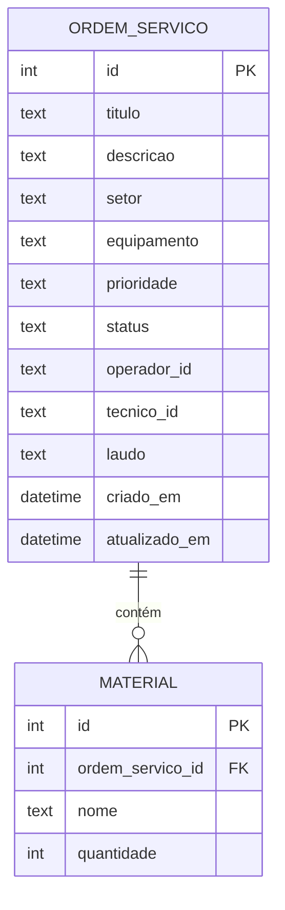

### Diagrama ER — SQLite Local (Apps)

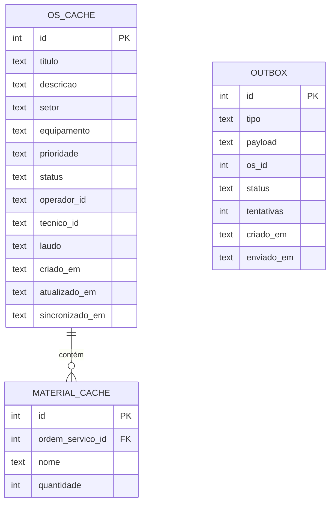

---

## 12. Máquina de Estados — Ordem de Serviço

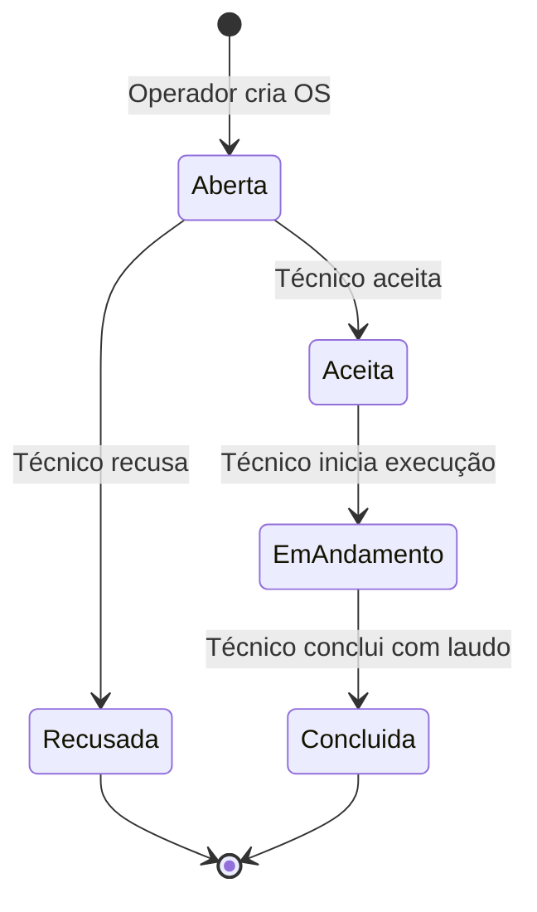

**Regras de transição:**

| Transição | Pré-condição | Campos obrigatórios | Código HTTP se violada |
|---|---|---|---|
| aberta → aceita | status == aberta | tecnico_id | 409 |
| aberta → recusada | status == aberta | tecnico_id | 409 |
| aceita → em_andamento | status == aceita | tecnico_id | 409 |
| em_andamento → concluida | status == em_andamento | tecnico_id, laudo | 409 |

- O backend **valida** cada transição e retorna **409 Conflict** se a pré-condição não for atendida
- Isso protege contra ações offline desatualizadas que tentam transições inválidas
- Todas as transições são primeiro gravadas na outbox local, depois enviadas ao backend

---

## 13. Decisões Arquiteturais

| Decisão | Justificativa |
|---|---|
| **Flask (Python)** como backend | Microframework leve, curva de aprendizado baixa, ideal para APIs REST de porte médio |
| **SQLite** como banco do servidor | Embutido no Python, não requer servidor separado, suficiente para o escopo do projeto |
| **RabbitMQ** como MOM | Broker robusto com suporte nativo a AMQP, filas duráveis e persistência de mensagens |
| **Exchange tipo direct** | Permite roteamento por routing key para filas específicas de cada perfil |
| **Filas duráveis com mensagens persistentes** | Garante que mensagens não são perdidas durante offline prolongado (semanas/meses) |
| **Sync-first ao reconectar** | Ao voltar online, GET /os traz o estado autoritativo do servidor antes de drenar a outbox — evita conflitos |
| **Descarte de mensagens AMQP antigas** | Após sync REST, mensagens acumuladas na fila representam estados intermediários já superados |
| **AMQP direto nos apps Flutter** | Fidelidade à EDA; apps assinam filas diretamente no broker sem polling |
| **Offline-first com SQLite local** | Apps funcionam sem rede por tempo indeterminado; outbox garante zero perda de ações |
| **Outbox Pattern** | Garante que nenhuma ação do usuário seja perdida; ordem preservada pelo campo `criado_em` |
| **409 Conflict para transições inválidas** | Backend é árbitro final; ações offline conflitantes são resolvidas automaticamente |
| **Podman Compose** para RabbitMQ | Ambiente reproduzível com um único comando, sem daemon root |
| **Portas expostas em `0.0.0.0`** | Necessário para que apps em emuladores ou dispositivos físicos alcancem Flask e RabbitMQ |
| **Clean Architecture nos apps** | Separação de responsabilidades (models/services/screens) facilita manutenção e testes |
| **connectivity_plus** para detecção de rede | Pacote Flutter maduro que detecta mudanças de conectividade automaticamente |

---

## 14. Fluxo Completo — Ponta a Ponta

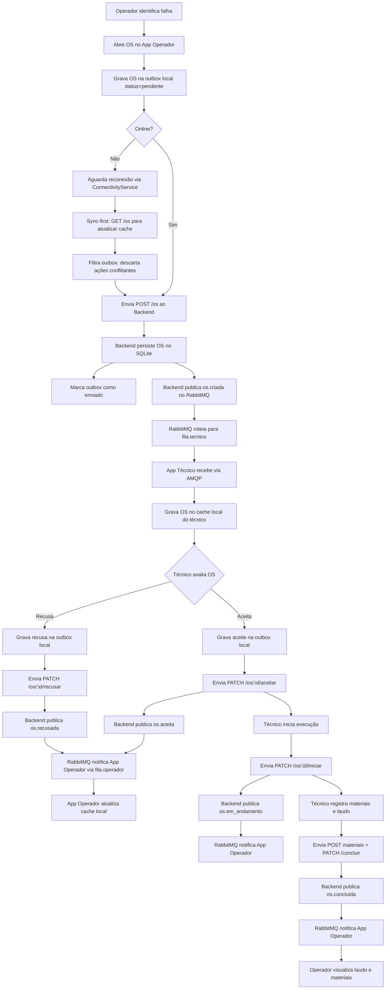

---

## 15. Protocolos de Comunicação

| Origem | Destino | Protocolo | Porta | Formato | Descrição |
|---|---|---|---|---|---|
| App Operador | Backend Flask | HTTP/1.1 REST | 5000 | JSON | Operações CRUD sobre OS + sync ao reconectar |
| App Técnico | Backend Flask | HTTP/1.1 REST | 5000 | JSON | Aceite, recusa, início, conclusão + sync ao reconectar |
| Backend Flask | RabbitMQ | AMQP 0-9-1 | 5672 | JSON | Publicação de eventos (mensagens persistentes) |
| RabbitMQ | App Operador | AMQP 0-9-1 | 5672 | JSON | Entrega de eventos via fila.operador (durável) |
| RabbitMQ | App Técnico | AMQP 0-9-1 | 5672 | JSON | Entrega de eventos via fila.tecnico (durável) |
| Backend Flask | SQLite (servidor) | File I/O | — | SQL | Persistência de dados do servidor |
| App Operador | SQLite (local) | File I/O | — | SQL | Cache offline + outbox de eventos |
| App Técnico | SQLite (local) | File I/O | — | SQL | Cache offline + outbox de eventos |

---

## 16. Requisitos Não-Funcionais

| Requisito | Descrição | Mecanismo |
|---|---|---|
| **Disponibilidade offline** | Apps funcionam sem conectividade por tempo indeterminado | SQLite local + outbox pattern |
| **Consistência eventual** | Estado dos apps converge com o servidor após sincronização | Sync-first + drain outbox |
| **Durabilidade de mensagens** | Mensagens AMQP não são perdidas durante offline | Filas duráveis + delivery_mode=2 |
| **Desacoplamento** | Apps não dependem diretamente um do outro | Backend + MOM como intermediários |
| **Latência de eventos (online)** | Eventos entregues quase instantaneamente | Conexão AMQP contínua |
| **Resiliência de conexão** | Backoff exponencial + retry automático | ConnectivityService + AmqpService |
| **Ordem de eventos** | Ações do usuário preservam ordem cronológica | Campo `criado_em` na outbox |
| **Idempotência** | Transições inválidas não corrompem o estado | Máquina de estados no backend + 409 |
| **Portabilidade** | Ambiente reproduzível | Podman Compose |
| **Acessibilidade de rede** | Emuladores e dispositivos físicos alcançam serviços | Portas em 0.0.0.0 |

---

## 17. Tecnologias e Dependências

### Backend (Python)

| Pacote | Versão | Uso |
|---|---|---|
| `flask` | ≥3.0 | Framework web REST |
| `pika` | ≥1.3 | Cliente AMQP para RabbitMQ |
| `flask-cors` | ≥4.0 | Habilitar CORS para apps móveis |
| `python-dotenv` | ≥1.0 | Variáveis de ambiente |

### Apps Flutter

| Pacote | Uso |
|---|---|
| `http` ou `dio` | Requisições HTTP REST |
| `dart_amqp` | Conexão AMQP direta com RabbitMQ |
| `sqflite` | SQLite local — cache de OS e outbox de eventos |
| `connectivity_plus` | Detecção de mudanças de conectividade |
| `provider` ou `riverpod` | Gerenciamento de estado |

### Infraestrutura

| Ferramenta | Versão | Uso |
|---|---|---|
| Podman / Podman Compose | ≥5.x / ≥1.x | Containerização do RabbitMQ |
| RabbitMQ | 3.12-management | Message broker + painel de administração |
