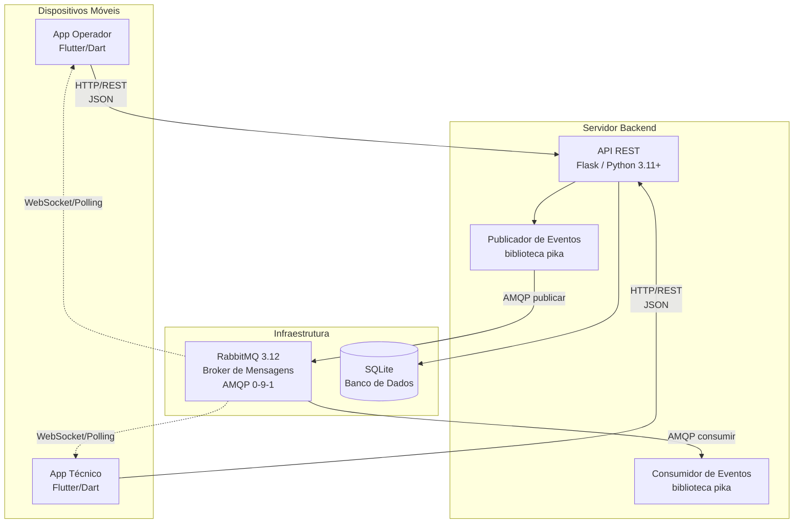
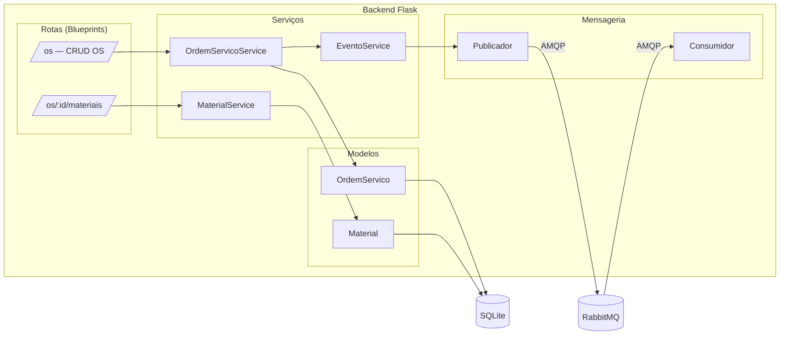
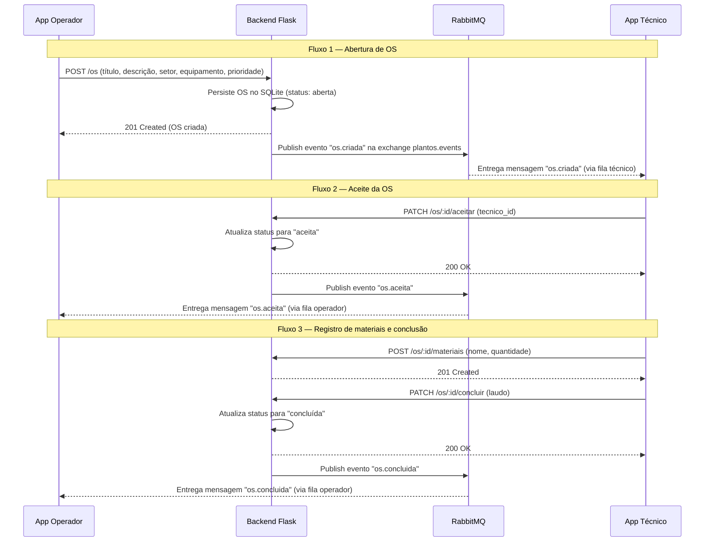
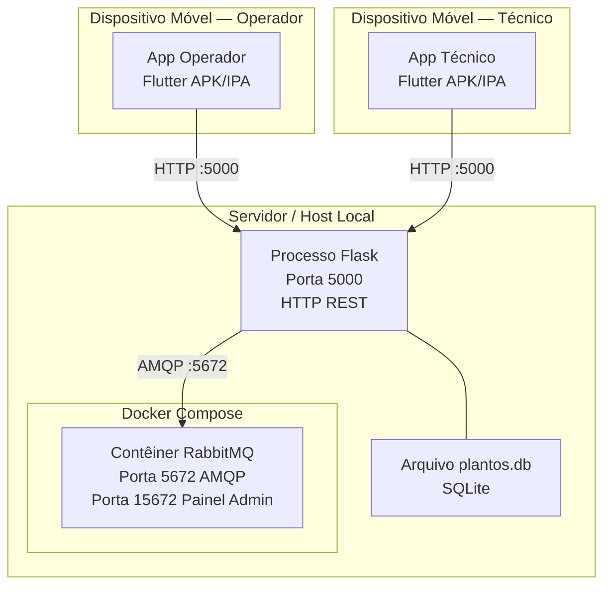
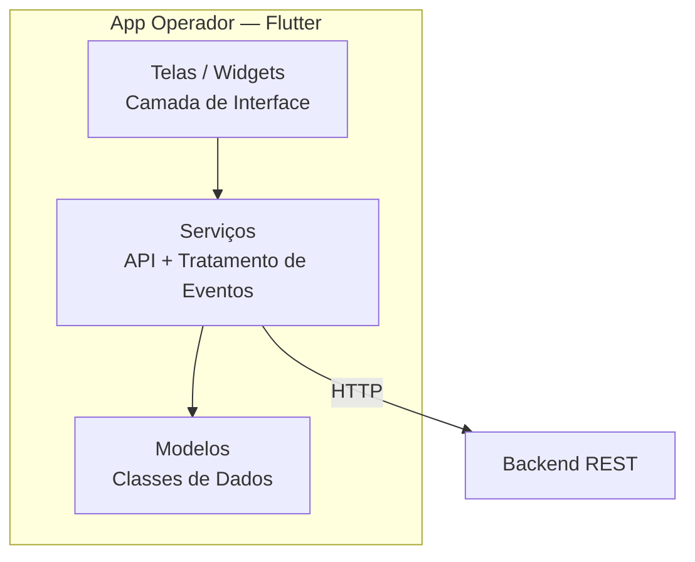
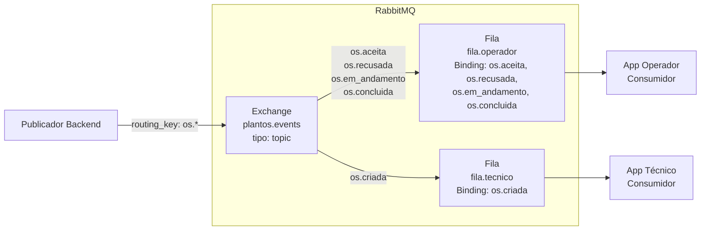
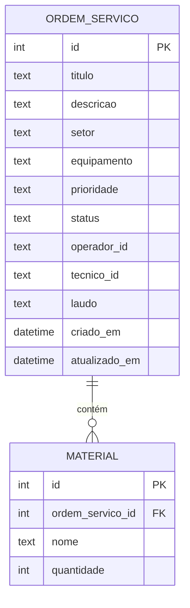
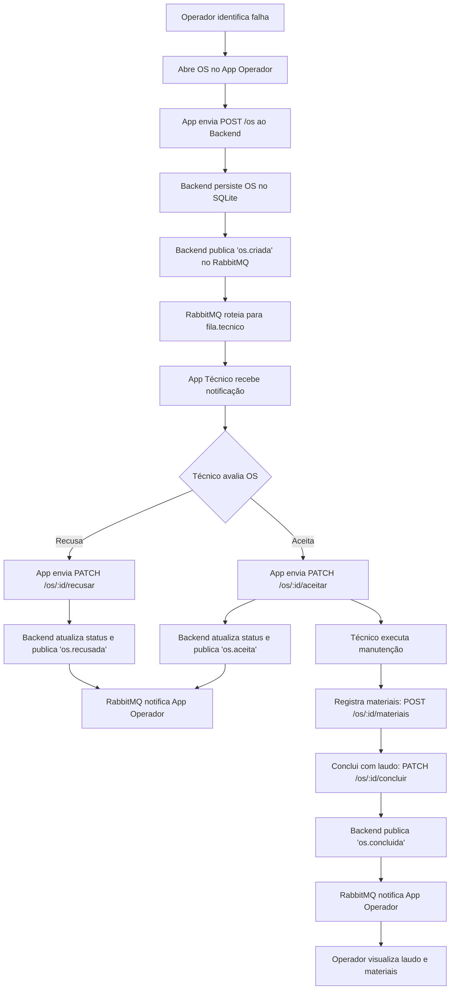

# Documento de Arquitetura — PlantOS

**Disciplina:** Lab. de Desenvolvimento de Aplicações Móveis e Distribuídas — PUC Minas  
**Curso:** Engenharia de Software — 5º Período  
**Semestre:** 1º Semestre 2026  
**Sprint:** 1 — Arquitetura e Backend REST

---

## 1. Visão Geral da Arquitetura

O PlantOS adota uma **Arquitetura Orientada a Eventos (Event-Driven Architecture — EDA)** com comunicação síncrona via REST e assíncrona via middleware de mensagens (RabbitMQ). O sistema é composto por quatro camadas principais:

1. **Camada de Apresentação** — Dois aplicativos móveis Flutter (Operador e Técnico)
2. **Camada de Serviço** — Backend REST em Flask (Python)
3. **Camada de Mensageria** — RabbitMQ como MOM (Message-Oriented Middleware)
4. **Camada de Persistência** — SQLite

---

## 2. Diagrama de Arquitetura (Visão de Contêineres — C4 Level 2)



---

## 3. Diagrama de Componentes (Backend)



---

## 4. Diagrama de Fluxo de Eventos



---

## 5. Diagrama de Implantação



---

## 6. Componentes Detalhados

### 6.1 App Operador (Flutter/Dart)

| Aspecto | Descrição |
|---|---|
| **Tecnologia** | Flutter 3.10+ / Dart 3.x |
| **Arquitetura interna** | Clean Architecture (models → services → screens) |
| **Comunicação síncrona** | HTTP REST (pacote `http` ou `dio`) |
| **Comunicação assíncrona** | Polling periódico com intervalo configurável (5s) ou WebSocket |
| **Telas mínimas** | Lista de OS, Detalhes da OS, Criar nova OS |

**Camadas do app:**



### 6.2 App Técnico (Flutter/Dart)

| Aspecto | Descrição |
|---|---|
| **Tecnologia** | Flutter 3.10+ / Dart 3.x |
| **Arquitetura interna** | Clean Architecture (models → services → screens) |
| **Comunicação síncrona** | HTTP REST (pacote `http` ou `dio`) |
| **Comunicação assíncrona** | Polling periódico ou WebSocket para receber novos eventos |
| **Telas mínimas** | Lista de OS pendentes, Detalhes (aceitar/recusar), OS em andamento |

### 6.3 Backend Flask (Python)

| Aspecto | Descrição |
|---|---|
| **Tecnologia** | Python 3.11+ / Flask |
| **Arquitetura interna** | Modular por responsabilidade (routes, services, models, messaging) |
| **Persistência** | SQLite via `sqlite3` nativo ou SQLAlchemy |
| **Mensageria** | Biblioteca `pika` para conexão AMQP com RabbitMQ |
| **Porta** | 5000 (HTTP) |

**Estrutura de módulos:**

```
backend/
├── app.py                    # Ponto de entrada, inicializa Flask app
├── requirements.txt          # Dependências (flask, pika, etc.)
└── app/
    ├── __init__.py           # Factory do app Flask
    ├── models/
    │   ├── __init__.py
    │   └── ordem_servico.py  # Modelos de dados + acesso ao banco
    ├── routes/
    │   ├── __init__.py
    │   └── os_routes.py      # Blueprints com endpoints REST
    ├── services/
    │   ├── __init__.py
    │   └── os_service.py     # Lógica de negócio
    └── messaging/
        ├── __init__.py
        ├── publisher.py      # Publica eventos no RabbitMQ
        └── consumer.py       # Consome eventos (opcional no backend)
```

### 6.4 RabbitMQ (MOM)

| Aspecto | Descrição |
|---|---|
| **Tecnologia** | RabbitMQ 3.12 com plugin Management |
| **Protocolo** | AMQP 0-9-1 |
| **Containerização** | Docker (via docker-compose.yml) |
| **Portas** | 5672 (AMQP), 15672 (Management UI) |
| **Credenciais dev** | guest / guest |

**Topologia de exchanges e filas:**



### 6.5 SQLite (Persistência)

| Aspecto | Descrição |
|---|---|
| **Tecnologia** | SQLite 3.x |
| **Arquivo** | `backend/plantos.db` (criado automaticamente) |
| **Acesso** | Via `sqlite3` nativo do Python ou SQLAlchemy |
| **Tabelas** | `ordem_servico`, `material` |

---

## 7. Protocolos de Comunicação

| Origem | Destino | Protocolo | Porta | Formato | Descrição |
|---|---|---|---|---|---|
| App Operador | Backend Flask | HTTP/1.1 REST | 5000 | JSON | Operações CRUD sobre OS |
| App Técnico | Backend Flask | HTTP/1.1 REST | 5000 | JSON | Aceite, recusa, conclusão de OS |
| Backend Flask | RabbitMQ | AMQP 0-9-1 | 5672 | JSON (payload) | Publicação de eventos |
| RabbitMQ | App Operador | AMQP/HTTP polling | 5672/5000 | JSON | Notificação de mudanças de estado |
| RabbitMQ | App Técnico | AMQP/HTTP polling | 5672/5000 | JSON | Notificação de novas OS |
| Backend Flask | SQLite | File I/O | — | SQL | Persistência de dados |

---

## 8. Modelo de Eventos (Mensageria)

### 8.1 Configuração do RabbitMQ

- **Exchange:** `plantos.events` (type: `topic`, durable: true)
- **Filas:**
  - `fila.operador` — Recebe eventos destinados ao operador
  - `fila.tecnico` — Recebe eventos destinados ao técnico
- **Bindings:**
  - `fila.tecnico` ← routing key `os.criada`
  - `fila.operador` ← routing keys `os.aceita`, `os.recusada`, `os.em_andamento`, `os.concluida`

### 8.2 Payloads dos Eventos

#### Evento `os.criada`

```json
{
  "evento": "os.criada",
  "timestamp": "2026-05-02T14:30:00Z",
  "dados": {
    "id": 1,
    "titulo": "Vazamento na válvula V-102",
    "descricao": "Vazamento de óleo identificado na válvula de controle V-102 do setor de caldeiras",
    "setor": "Caldeiras",
    "equipamento": "Válvula V-102",
    "prioridade": "alta",
    "status": "aberta",
    "operador_id": "op-001",
    "criado_em": "2026-05-02T14:30:00Z"
  }
}
```

#### Evento `os.aceita`

```json
{
  "evento": "os.aceita",
  "timestamp": "2026-05-02T14:35:00Z",
  "dados": {
    "id": 1,
    "titulo": "Vazamento na válvula V-102",
    "status": "aceita",
    "tecnico_id": "tec-003",
    "atualizado_em": "2026-05-02T14:35:00Z"
  }
}
```

#### Evento `os.recusada`

```json
{
  "evento": "os.recusada",
  "timestamp": "2026-05-02T14:35:00Z",
  "dados": {
    "id": 1,
    "titulo": "Vazamento na válvula V-102",
    "status": "recusada",
    "tecnico_id": "tec-003",
    "atualizado_em": "2026-05-02T14:35:00Z"
  }
}
```

#### Evento `os.em_andamento`

```json
{
  "evento": "os.em_andamento",
  "timestamp": "2026-05-02T15:00:00Z",
  "dados": {
    "id": 1,
    "titulo": "Vazamento na válvula V-102",
    "status": "em_andamento",
    "tecnico_id": "tec-003",
    "atualizado_em": "2026-05-02T15:00:00Z"
  }
}
```

#### Evento `os.concluida`

```json
{
  "evento": "os.concluida",
  "timestamp": "2026-05-02T17:00:00Z",
  "dados": {
    "id": 1,
    "titulo": "Vazamento na válvula V-102",
    "status": "concluida",
    "tecnico_id": "tec-003",
    "laudo": "Substituição da gaxeta da válvula V-102. Teste de pressão realizado com sucesso.",
    "materiais": [
      {"nome": "Gaxeta 3/4\"", "quantidade": 2},
      {"nome": "Anel O-Ring", "quantidade": 4}
    ],
    "atualizado_em": "2026-05-02T17:00:00Z"
  }
}
```

---

## 9. Endpoints REST — Especificação Detalhada

### 9.1 Criar Ordem de Serviço

```
POST /os
Content-Type: application/json

Request Body:
{
  "titulo": "Vazamento na válvula V-102",
  "descricao": "Vazamento de óleo identificado na válvula de controle V-102",
  "setor": "Caldeiras",
  "equipamento": "Válvula V-102",
  "prioridade": "alta",
  "operador_id": "op-001"
}

Response: 201 Created
{
  "id": 1,
  "titulo": "Vazamento na válvula V-102",
  "descricao": "Vazamento de óleo identificado na válvula de controle V-102",
  "setor": "Caldeiras",
  "equipamento": "Válvula V-102",
  "prioridade": "alta",
  "status": "aberta",
  "operador_id": "op-001",
  "tecnico_id": null,
  "laudo": null,
  "criado_em": "2026-05-02T14:30:00Z",
  "atualizado_em": "2026-05-02T14:30:00Z"
}
```

### 9.2 Listar Ordens de Serviço

```
GET /os
GET /os?status=aberta
GET /os?operador_id=op-001

Response: 200 OK
[
  {
    "id": 1,
    "titulo": "Vazamento na válvula V-102",
    "status": "aberta",
    "prioridade": "alta",
    "setor": "Caldeiras",
    "criado_em": "2026-05-02T14:30:00Z"
  }
]
```

### 9.3 Consultar OS por ID

```
GET /os/:id

Response: 200 OK
{
  "id": 1,
  "titulo": "Vazamento na válvula V-102",
  "descricao": "Vazamento de óleo identificado...",
  "setor": "Caldeiras",
  "equipamento": "Válvula V-102",
  "prioridade": "alta",
  "status": "aberta",
  "operador_id": "op-001",
  "tecnico_id": null,
  "laudo": null,
  "criado_em": "2026-05-02T14:30:00Z",
  "atualizado_em": "2026-05-02T14:30:00Z"
}
```

### 9.4 Aceitar OS

```
PATCH /os/:id/aceitar
Content-Type: application/json

Request Body:
{
  "tecnico_id": "tec-003"
}

Response: 200 OK
{
  "id": 1,
  "status": "aceita",
  "tecnico_id": "tec-003",
  "atualizado_em": "2026-05-02T14:35:00Z"
}
```

### 9.5 Recusar OS

```
PATCH /os/:id/recusar
Content-Type: application/json

Request Body:
{
  "tecnico_id": "tec-003"
}

Response: 200 OK
{
  "id": 1,
  "status": "recusada",
  "atualizado_em": "2026-05-02T14:35:00Z"
}
```

### 9.6 Concluir OS

```
PATCH /os/:id/concluir
Content-Type: application/json

Request Body:
{
  "tecnico_id": "tec-003",
  "laudo": "Substituição da gaxeta da válvula V-102. Teste de pressão realizado com sucesso."
}

Response: 200 OK
{
  "id": 1,
  "status": "concluida",
  "laudo": "Substituição da gaxeta...",
  "atualizado_em": "2026-05-02T17:00:00Z"
}
```

### 9.7 Registrar Materiais

```
POST /os/:id/materiais
Content-Type: application/json

Request Body:
{
  "nome": "Gaxeta 3/4\"",
  "quantidade": 2
}

Response: 201 Created
{
  "id": 1,
  "ordem_servico_id": 1,
  "nome": "Gaxeta 3/4\"",
  "quantidade": 2
}
```

### 9.8 Listar Materiais de uma OS

```
GET /os/:id/materiais

Response: 200 OK
[
  {"id": 1, "nome": "Gaxeta 3/4\"", "quantidade": 2},
  {"id": 2, "nome": "Anel O-Ring", "quantidade": 4}
]
```

---

## 10. Modelo de Dados (Schema SQLite)

```sql
CREATE TABLE IF NOT EXISTS ordem_servico (
    id INTEGER PRIMARY KEY AUTOINCREMENT,
    titulo TEXT NOT NULL,
    descricao TEXT NOT NULL,
    setor TEXT NOT NULL,
    equipamento TEXT NOT NULL,
    prioridade TEXT NOT NULL CHECK(prioridade IN ('baixa', 'media', 'alta', 'critica')),
    status TEXT NOT NULL DEFAULT 'aberta' CHECK(status IN ('aberta', 'aceita', 'em_andamento', 'concluida', 'recusada')),
    operador_id TEXT NOT NULL,
    tecnico_id TEXT,
    laudo TEXT,
    criado_em DATETIME DEFAULT CURRENT_TIMESTAMP,
    atualizado_em DATETIME DEFAULT CURRENT_TIMESTAMP
);

CREATE TABLE IF NOT EXISTS material (
    id INTEGER PRIMARY KEY AUTOINCREMENT,
    ordem_servico_id INTEGER NOT NULL,
    nome TEXT NOT NULL,
    quantidade INTEGER NOT NULL CHECK(quantidade > 0),
    FOREIGN KEY (ordem_servico_id) REFERENCES ordem_servico(id)
);
```

### Diagrama ER



---

## 11. Máquina de Estados — Ordem de Serviço


**Regras de transição:**
- Apenas OS com status `aberta` podem ser aceitas ou recusadas
- Apenas OS com status `aceita` podem passar para `em_andamento`
- Apenas OS com status `em_andamento` podem ser concluídas
- Conclusão exige um laudo técnico preenchido

---

## 12. Decisões Arquiteturais

| Decisão | Justificativa |
|---|---|
| **Flask (Python)** como backend | Microframework leve, curva de aprendizado baixa, ideal para APIs REST de porte médio |
| **SQLite** como banco | Embutido no Python, não requer servidor separado, suficiente para o escopo do projeto |
| **RabbitMQ** como MOM | Broker robusto com suporte nativo a AMQP, exchanges do tipo topic permitem roteamento flexível de eventos |
| **Exchange tipo topic** | Permite roteamento por padrão de routing key (ex.: `os.*`), facilitando a adição de novos eventos futuramente |
| **Docker Compose** para RabbitMQ | Garante reprodutibilidade do ambiente, facilita setup em qualquer máquina |
| **Polling nos apps Flutter** | Mais simples que conexão AMQP direta no mobile; pode evoluir para WebSocket na Sprint 4 |
| **Clean Architecture nos apps** | Separação de responsabilidades (models/services/screens) facilita manutenção e testes |

---

## 13. Fluxo Completo — Ponta a Ponta



---

## 14. Requisitos Não-Funcionais

| Requisito | Descrição |
|---|---|
| **Disponibilidade** | O sistema deve operar enquanto o backend e RabbitMQ estiverem ativos |
| **Desacoplamento** | Apps não dependem diretamente um do outro; toda comunicação passa pelo backend + MOM |
| **Latência de eventos** | Eventos devem ser entregues em menos de 5 segundos após publicação (configuração de polling) |
| **Escalabilidade** | Topologia RabbitMQ permite adicionar filas/consumidores sem alterar o producer |
| **Resiliência** | Mensagens persistem nas filas do RabbitMQ até serem consumidas (durable queues) |
| **Portabilidade** | Docker Compose garante que o ambiente é reproduzível em qualquer SO |

---

## 15. Tecnologias e Dependências

### Backend (Python)

| Pacote | Versão | Uso |
|---|---|---|
| `flask` | ≥3.0 | Framework web REST |
| `pika` | ≥1.3 | Cliente AMQP para RabbitMQ |
| `flask-cors` | ≥4.0 | Habilitar CORS para apps móveis |

### Apps Flutter

| Pacote | Uso |
|---|---|
| `http` ou `dio` | Requisições HTTP REST |
| `dart_amqp` (opcional) | Conexão AMQP direta com RabbitMQ |
| `provider` ou `riverpod` | Gerenciamento de estado |

### Infraestrutura

| Ferramenta | Versão | Uso |
|---|---|---|
| Docker | ≥24.x | Containerização |
| Docker Compose | ≥3.8 | Orquestração do RabbitMQ |
| RabbitMQ | 3.12 | Message broker |
