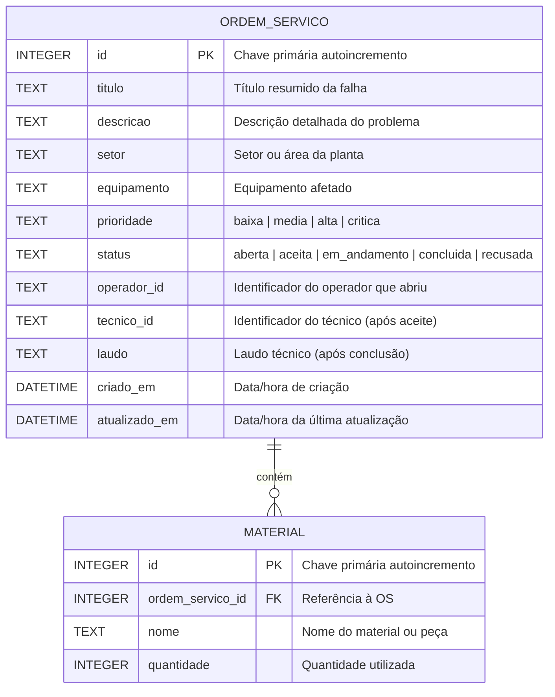
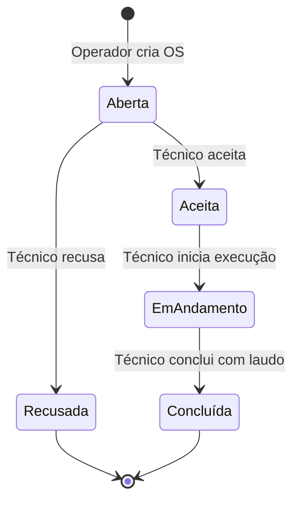

# Documentação do Banco de Dados — PlantOS

**Tecnologia:** SQLite 3.x  
**Arquivo:** `backend/plantos.db` (criado automaticamente na inicialização)  
**Acesso:** Módulo nativo `sqlite3` do Python  
**Foreign Keys:** Habilitado via `PRAGMA foreign_keys = ON`

---

## 1. Diagrama Entidade-Relacionamento



---

## 2. Schema SQL (DDL)

```sql
-- =============================================================
-- PlantOS — Schema do Banco de Dados SQLite
-- Arquivo: backend/plantos.db
-- =============================================================

-- Tabela principal: Ordens de Serviço
CREATE TABLE IF NOT EXISTS ordem_servico (
    id              INTEGER PRIMARY KEY AUTOINCREMENT,
    titulo          TEXT     NOT NULL,
    descricao       TEXT     NOT NULL,
    setor           TEXT     NOT NULL,
    equipamento     TEXT     NOT NULL,
    prioridade      TEXT     NOT NULL CHECK(prioridade IN ('baixa', 'media', 'alta', 'critica')),
    status          TEXT     NOT NULL DEFAULT 'aberta'
                             CHECK(status IN ('aberta', 'aceita', 'em_andamento', 'concluida', 'recusada')),
    operador_id     TEXT     NOT NULL,
    tecnico_id      TEXT,
    laudo           TEXT,
    criado_em       DATETIME DEFAULT CURRENT_TIMESTAMP,
    atualizado_em   DATETIME DEFAULT CURRENT_TIMESTAMP
);

-- Tabela de materiais utilizados em cada OS
CREATE TABLE IF NOT EXISTS material (
    id                 INTEGER PRIMARY KEY AUTOINCREMENT,
    ordem_servico_id   INTEGER NOT NULL,
    nome               TEXT    NOT NULL,
    quantidade         INTEGER NOT NULL CHECK(quantidade > 0),
    FOREIGN KEY (ordem_servico_id) REFERENCES ordem_servico(id)
);
```

---

## 3. Descrição das Tabelas

### 3.1 `ordem_servico`

Tabela central do sistema. Armazena cada ordem de serviço com seu ciclo de vida completo.

| Coluna | Tipo | Nulo? | Default | Restrição | Descrição |
|---|---|---|---|---|---|
| `id` | INTEGER | Não | Auto | PK, AUTOINCREMENT | Identificador único da OS |
| `titulo` | TEXT | Não | — | NOT NULL | Título curto descrevendo a falha |
| `descricao` | TEXT | Não | — | NOT NULL | Descrição detalhada do problema |
| `setor` | TEXT | Não | — | NOT NULL | Setor ou área da planta industrial |
| `equipamento` | TEXT | Não | — | NOT NULL | Nome/código do equipamento afetado |
| `prioridade` | TEXT | Não | — | CHECK IN ('baixa','media','alta','critica') | Nível de urgência da OS |
| `status` | TEXT | Não | 'aberta' | CHECK IN ('aberta','aceita','em_andamento','concluida','recusada') | Estado atual no ciclo de vida |
| `operador_id` | TEXT | Não | — | NOT NULL | ID do operador que criou a OS |
| `tecnico_id` | TEXT | Sim | NULL | — | ID do técnico que aceitou (preenchido após aceite) |
| `laudo` | TEXT | Sim | NULL | — | Laudo técnico (preenchido na conclusão) |
| `criado_em` | DATETIME | Não | CURRENT_TIMESTAMP | — | Timestamp de criação |
| `atualizado_em` | DATETIME | Não | CURRENT_TIMESTAMP | — | Timestamp da última atualização |

### 3.2 `material`

Tabela de materiais e peças utilizados durante a execução de uma OS. Relacionamento N:1 com `ordem_servico`.

| Coluna | Tipo | Nulo? | Default | Restrição | Descrição |
|---|---|---|---|---|---|
| `id` | INTEGER | Não | Auto | PK, AUTOINCREMENT | Identificador único do registro |
| `ordem_servico_id` | INTEGER | Não | — | FK → ordem_servico(id) | Referência à OS associada |
| `nome` | TEXT | Não | — | NOT NULL | Nome do material ou peça utilizada |
| `quantidade` | INTEGER | Não | — | CHECK(quantidade > 0) | Quantidade utilizada (mínimo 1) |

---

## 4. Relacionamentos

| Tabela Origem | Tabela Destino | Tipo | Chave | Descrição |
|---|---|---|---|---|
| `material` | `ordem_servico` | N:1 | `material.ordem_servico_id` → `ordem_servico.id` | Cada OS pode ter zero ou mais materiais registrados |

---

## 5. Regras de Integridade

### 5.1 Constraints de Domínio (CHECK)

| Tabela | Coluna | Valores Permitidos |
|---|---|---|
| `ordem_servico` | `prioridade` | `'baixa'`, `'media'`, `'alta'`, `'critica'` |
| `ordem_servico` | `status` | `'aberta'`, `'aceita'`, `'em_andamento'`, `'concluida'`, `'recusada'` |
| `material` | `quantidade` | Inteiro > 0 |

### 5.2 Integridade Referencial

- `PRAGMA foreign_keys = ON` é ativado a cada conexão para garantir que:
  - Não é possível inserir um `material` com `ordem_servico_id` inexistente
  - Remoção de uma OS com materiais associados será bloqueada (comportamento padrão `RESTRICT`)

### 5.3 Regras de Negócio (aplicadas na camada de serviço)

| Regra | Descrição |
|---|---|
| Transição de status | Apenas transições válidas são permitidas (ver máquina de estados) |
| Aceite | Requer `tecnico_id`; OS deve estar com status `aberta` |
| Recusa | Requer `tecnico_id`; OS deve estar com status `aberta` |
| Conclusão | Requer `laudo` preenchido; OS deve estar com status `em_andamento` |
| Registro de material | OS deve existir; `quantidade` > 0 |

---

## 6. Máquina de Estados — Transições de `status`



| Transição | De | Para | Pré-condição |
|---|---|---|---|
| Criar | — | `aberta` | Campos obrigatórios preenchidos |
| Aceitar | `aberta` | `aceita` | `tecnico_id` informado |
| Recusar | `aberta` | `recusada` | `tecnico_id` informado |
| Iniciar | `aceita` | `em_andamento` | OS aceita pelo técnico |
| Concluir | `em_andamento` | `concluida` | `laudo` preenchido |

---

## 7. Exemplos de Consultas

### Criar uma OS

```sql
INSERT INTO ordem_servico (titulo, descricao, setor, equipamento, prioridade, operador_id)
VALUES ('Vazamento na válvula V-102', 'Vazamento de óleo identificado...', 'Caldeiras', 'Válvula V-102', 'alta', 'op-001');
```

### Listar OS abertas

```sql
SELECT * FROM ordem_servico WHERE status = 'aberta' ORDER BY criado_em DESC;
```

### Aceitar uma OS

```sql
UPDATE ordem_servico
SET status = 'aceita', tecnico_id = 'tec-003', atualizado_em = CURRENT_TIMESTAMP
WHERE id = 1 AND status = 'aberta';
```

### Registrar material

```sql
INSERT INTO material (ordem_servico_id, nome, quantidade)
VALUES (1, 'Gaxeta 3/4"', 2);
```

### Listar materiais de uma OS

```sql
SELECT * FROM material WHERE ordem_servico_id = 1;
```

### Concluir OS com laudo

```sql
UPDATE ordem_servico
SET status = 'concluida', laudo = 'Substituição da gaxeta realizada...', atualizado_em = CURRENT_TIMESTAMP
WHERE id = 1 AND status = 'em_andamento';
```

---

## 8. Estrutura de Código (Camada de Dados)

```
backend/
├── plantos.db                    # Banco SQLite (gerado automaticamente)
└── app/
    ├── database.py               # Conexão, inicialização e PRAGMA
    └── models/
        ├── __init__.py
        ├── ordem_servico.py      # CRUD da tabela ordem_servico
        └── material.py           # CRUD da tabela material
```

| Arquivo | Responsabilidade |
|---|---|
| `database.py` | Gerencia conexão com SQLite, inicializa tabelas, habilita foreign keys |
| `ordem_servico.py` | Classe `OrdemServico` com métodos `criar`, `listar`, `buscar_por_id`, `atualizar_status` |
| `material.py` | Classe `Material` com métodos `criar`, `listar_por_os`, `buscar_por_id` |
