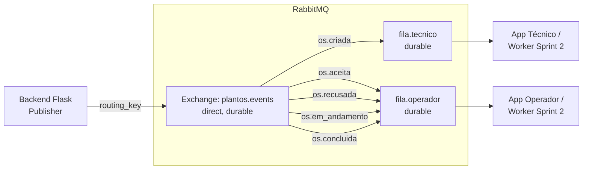

# Documentação dos Eventos — Sprint 2

**Disciplina:** Lab. de Desenvolvimento de Aplicações Móveis e Distribuídas — PUC Minas  
**Projeto:** PlantOS  
**Sprint:** 2 — Integração com Middleware Orientado a Mensagens (MOM)

---

## 1. Visão Geral

O PlantOS é um sistema **orientado a eventos (Event-Driven Architecture)**.
Toda mudança relevante no domínio de Ordens de Serviço é **publicada como evento**
no RabbitMQ pelo backend Flask e **consumida assincronamente** por consumidores
interessados (apps Flutter nas Sprints 3 e 4, worker de auditoria nesta sprint).

A comunicação entre produtor e consumidor é **100% indireta**: nenhum
consumidor faz chamada REST de volta ao backend para "saber" do evento — ele
recebe a mensagem diretamente da fila AMQP a que está inscrito.

---

## 2. Topologia RabbitMQ

| Recurso | Nome | Tipo | Durável | Observação |
|---|---|---|---|---|
| Exchange | `plantos.events` | `direct` | sim | Único exchange do sistema |
| Fila | `fila.operador` | classic | sim | Consumida pelos apps de operadores |
| Fila | `fila.tecnico`  | classic | sim | Consumida pelos apps de técnicos |

**Bindings (exchange → fila por routing key):**



**Propriedades das mensagens publicadas:**

| Propriedade | Valor | Justificativa |
|---|---|---|
| `delivery_mode` | `2` (persistente) | Mensagens sobrevivem a reinício do broker |
| `content_type` | `application/json` | Payload sempre JSON UTF-8 |
| `mandatory` | `false` | Se nenhuma fila estiver vinculada, mensagem é descartada (não bloqueia o backend) |

---

## 3. Catálogo de Eventos

Cada evento é uma mensagem JSON com a estrutura uniforme:

```json
{
  "evento": "<routing_key>",
  "timestamp": "<ISO-8601 UTC>",
  "dados": { ...estado atual da OS... }
}
```

### 3.1 `os.criada`

| Atributo | Valor |
|---|---|
| **Produtor** | Backend Flask — `OSService.criar_os()` ao processar `POST /os` |
| **Consumidor** | App do Técnico (Sprint 4) + Worker de auditoria (Sprint 2) |
| **Routing key** | `os.criada` |
| **Fila destino** | `fila.tecnico` |
| **Gatilho** | Operador cria nova Ordem de Serviço |
| **Semântica** | Notificar técnicos de que existe uma nova OS pendente |

**Payload de exemplo:**

```json
{
  "evento": "os.criada",
  "timestamp": "2026-05-25T14:32:10.123456+00:00",
  "dados": {
    "id": 12,
    "titulo": "Vazamento na válvula V-102",
    "descricao": "Vazamento de óleo identificado na base da válvula V-102.",
    "setor": "Caldeiras",
    "equipamento": "Válvula V-102",
    "prioridade": "alta",
    "status": "aberta",
    "operador_id": "user-3",
    "tecnico_id": null,
    "laudo": null,
    "criado_em": "2026-05-25T14:32:10.000000Z",
    "atualizado_em": "2026-05-25T14:32:10.000000Z"
  }
}
```

---

### 3.2 `os.aceita`

| Atributo | Valor |
|---|---|
| **Produtor** | Backend Flask — `OSService.transicionar_status('aceita')` ao processar `PATCH /os/<id>/aceitar` |
| **Consumidor** | App do Operador (Sprint 3) + Worker de auditoria |
| **Routing key** | `os.aceita` |
| **Fila destino** | `fila.operador` |
| **Gatilho** | Técnico aceita uma OS aberta |
| **Semântica** | Notificar o operador que sua OS foi assumida por um técnico |

**Payload de exemplo:**

```json
{
  "evento": "os.aceita",
  "timestamp": "2026-05-25T14:40:55.654321+00:00",
  "dados": {
    "id": 12,
    "titulo": "Vazamento na válvula V-102",
    "status": "aceita",
    "operador_id": "user-3",
    "tecnico_id": "user-7",
    "atualizado_em": "2026-05-25T14:40:55.000000Z"
  }
}
```

---

### 3.3 `os.recusada`

| Atributo | Valor |
|---|---|
| **Produtor** | Backend Flask — `OSService.transicionar_status('recusada')` ao processar `PATCH /os/<id>/recusar` |
| **Consumidor** | App do Operador + Worker de auditoria |
| **Routing key** | `os.recusada` |
| **Fila destino** | `fila.operador` |
| **Gatilho** | Técnico recusa uma OS aberta |
| **Semântica** | Notificar o operador que a OS foi recusada e precisa ser reavaliada |

**Payload de exemplo:**

```json
{
  "evento": "os.recusada",
  "timestamp": "2026-05-25T14:41:30.987654+00:00",
  "dados": {
    "id": 12,
    "titulo": "Vazamento na válvula V-102",
    "status": "recusada",
    "operador_id": "user-3",
    "tecnico_id": "user-7",
    "atualizado_em": "2026-05-25T14:41:30.000000Z"
  }
}
```

---

### 3.4 `os.em_andamento`

| Atributo | Valor |
|---|---|
| **Produtor** | Backend Flask — `OSService.transicionar_status('em_andamento')` ao processar `PATCH /os/<id>/iniciar` |
| **Consumidor** | App do Operador + Worker de auditoria |
| **Routing key** | `os.em_andamento` |
| **Fila destino** | `fila.operador` |
| **Gatilho** | Técnico inicia execução da OS aceita |
| **Semântica** | Atualizar o operador de que a manutenção está em curso |

**Payload de exemplo:**

```json
{
  "evento": "os.em_andamento",
  "timestamp": "2026-05-25T15:02:14.111222+00:00",
  "dados": {
    "id": 12,
    "status": "em_andamento",
    "operador_id": "user-3",
    "tecnico_id": "user-7",
    "atualizado_em": "2026-05-25T15:02:14.000000Z"
  }
}
```

---

### 3.5 `os.concluida`

| Atributo | Valor |
|---|---|
| **Produtor** | Backend Flask — `OSService.transicionar_status('concluida')` ao processar `PATCH /os/<id>/concluir` |
| **Consumidor** | App do Operador + Worker de auditoria |
| **Routing key** | `os.concluida` |
| **Fila destino** | `fila.operador` |
| **Gatilho** | Técnico conclui OS com laudo técnico |
| **Semântica** | Notificar o operador que o serviço foi finalizado e o laudo está disponível |

**Payload de exemplo:**

```json
{
  "evento": "os.concluida",
  "timestamp": "2026-05-25T16:18:42.555444+00:00",
  "dados": {
    "id": 12,
    "status": "concluida",
    "operador_id": "user-3",
    "tecnico_id": "user-7",
    "laudo": "Substituída gaxeta desgastada. Vazamento eliminado.",
    "atualizado_em": "2026-05-25T16:18:42.000000Z"
  }
}
```

---

## 4. Tabela-Resumo dos Eventos

| Evento | Routing Key | Produtor | Consumidor | Fila |
|---|---|---|---|---|
| OS criada | `os.criada` | Backend (POST `/os`) | App Técnico / Worker | `fila.tecnico` |
| OS aceita | `os.aceita` | Backend (PATCH `/os/<id>/aceitar`) | App Operador / Worker | `fila.operador` |
| OS recusada | `os.recusada` | Backend (PATCH `/os/<id>/recusar`) | App Operador / Worker | `fila.operador` |
| OS em andamento | `os.em_andamento` | Backend (PATCH `/os/<id>/iniciar`) | App Operador / Worker | `fila.operador` |
| OS concluída | `os.concluida` | Backend (PATCH `/os/<id>/concluir`) | App Operador / Worker | `fila.operador` |

---

## 5. Produtor — `backend/app/messaging/publisher.py`

Função pública: `publish_event(routing_key: str, payload: dict)`

Responsabilidades:
* Abrir conexão AMQP com o broker
* Declarar o exchange `plantos.events` (idempotente)
* Empacotar o payload de domínio em um envelope `{evento, timestamp, dados}`
* Publicar com `delivery_mode=2` (persistente) e `content_type=application/json`
* Fechar a conexão

A função é chamada pelo `OSService` sempre que uma transição de estado é
persistida. Falhas de conexão **não bloqueiam** a operação REST do usuário —
são absorvidas e logadas (decisão de design discutida no relatório de
integração).

---

## 6. Consumidor — `backend/app/messaging/consumer.py`

Worker autônomo (`python worker.py`) que:

* Assina **ambas** as filas duráveis (`fila.operador` e `fila.tecnico`)
* Para cada mensagem recebida:
  1. Decodifica o JSON
  2. Imprime no console um log estruturado (`fila | routing_key | os_id | status`)
  3. **Persiste o evento na tabela `evento_log`** (auditoria imutável)
  4. Faz `basic_ack` (entrega confiável)
* Reconecta automaticamente caso o RabbitMQ esteja indisponível na inicialização

O worker simula o comportamento que os apps Flutter terão nas próximas sprints
e serve como **evidência objetiva** de que o ciclo produtor → broker →
consumidor está funcionando.

---

## 7. Evidências de Funcionamento

Existem três formas complementares de comprovar que o MOM está operacional:

| Evidência | Como obter |
|---|---|
| **Painel admin RabbitMQ** | <http://localhost:15672> (guest/guest) — aba *Queues* mostra `fila.operador` e `fila.tecnico` com mensagens publicadas/consumidas |
| **Console do worker** | `python backend/worker.py` — imprime cada evento consumido |
| **Tabela `evento_log`** | `SELECT * FROM evento_log;` no SQLite — histórico permanente de eventos consumidos |
| **Script de integração** | `python backend/tests/integration_rabbitmq.py` — publica + consome + valida em um único comando |
| **Testes unitários** | `pytest backend/tests/` — 21 testes validam que `publish_event` é chamado nos pontos corretos do fluxo |
